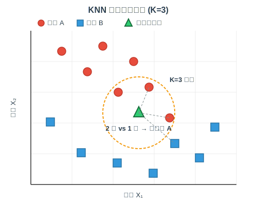
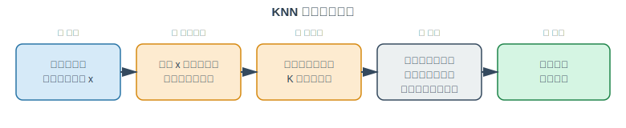
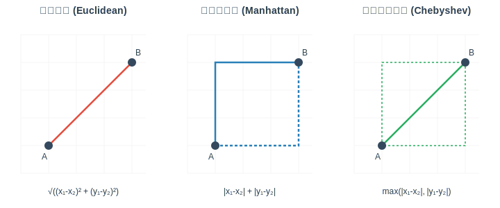
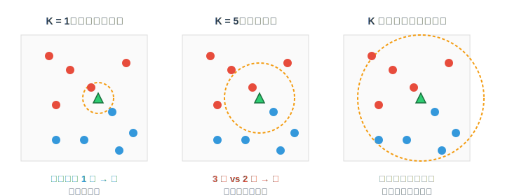

# KNN 算法原理

## 一、什么是 KNN

**K 近邻算法（K-Nearest Neighbors, KNN）** 是一种最经典、最直观的监督学习算法，既可用于**分类**，也可用于**回归**。

它的核心思想可以用一句俗话概括：

> **"物以类聚，人以群分" —— 一个样本的类别，由它周围最靠近的 K 个样本共同决定。**

KNN 属于 **懒惰学习（Lazy Learning）** 与 **基于实例的学习（Instance-based Learning）**：
- 训练阶段几乎不做任何事，仅仅是"记住"所有训练样本；
- 预测阶段才真正开始计算 —— 把待预测样本与所有训练样本比对，找出最近的 K 个，然后投票或平均。

---

## 二、算法直观理解

以二分类问题为例，假设特征空间中已有若干红色（类 A）与蓝色（类 B）样本，现在要对一个新样本（绿色三角形）进行分类：



**判断过程**：

1. 以待预测样本为中心，"扩张"一个邻域，直到囊括 K 个训练样本；
2. 统计这 K 个样本的类别分布；
3. 出现次数最多的类别，就是待预测样本的类别。

在上图中 K=3，邻域内有 2 个红色、1 个蓝色，因此该样本被判为 **类别 A**。

---

## 三、算法流程



形式化描述如下：

> **输入**：训练集 $D = \{(x_1, y_1), (x_2, y_2), \dots, (x_n, y_n)\}$，待预测样本 $x$，近邻数 $K$，距离度量 $d(\cdot, \cdot)$
>
> **输出**：$x$ 的预测标签 $\hat{y}$
>
> **步骤**：
> 1. 对每个训练样本 $x_i$，计算距离 $d(x, x_i)$；
> 2. 按距离升序排序，取前 $K$ 个样本，记为集合 $N_K(x)$；
> 3. **分类任务**：$\hat{y} = \arg\max_{c} \sum_{x_i \in N_K(x)} \mathbb{I}(y_i = c)$
> 4. **回归任务**：$\hat{y} = \frac{1}{K}\sum_{x_i \in N_K(x)} y_i$

---

## 四、距离度量

距离度量决定了"什么样的样本算是相似"，是 KNN 的关键组成部分。



### 1. 欧氏距离（Euclidean Distance）

最常用的距离度量，表示空间中两点的**直线距离**：

$$d(x, y) = \sqrt{\sum_{i=1}^{n}(x_i - y_i)^2}$$

- 适用场景：连续型数值特征、特征量纲相近或已归一化。

### 2. 曼哈顿距离（Manhattan Distance）

也称 L1 距离，模拟在方格街道上行走的距离：

$$d(x, y) = \sum_{i=1}^{n} |x_i - y_i|$$

- 适用场景：特征维度较高、存在离群点、更关注每个维度的绝对差异。

### 3. 切比雪夫距离（Chebyshev Distance）

取各维度差异的最大值，类似"国王在棋盘上的步数"：

$$d(x, y) = \max_i |x_i - y_i|$$

### 4. 闵可夫斯基距离（Minkowski Distance）

上述三种距离的统一形式：

$$d(x, y) = \left(\sum_{i=1}^{n} |x_i - y_i|^p\right)^{1/p}$$

- $p=1$ 即曼哈顿距离；$p=2$ 即欧氏距离；$p\to\infty$ 即切比雪夫距离。

### 5. 余弦相似度（Cosine Similarity）

衡量向量方向的接近程度，常用于文本、推荐系统：

$$\cos(\theta) = \frac{x \cdot y}{\|x\| \cdot \|y\|}$$

---

## 五、K 值的选择

K 值直接影响模型的复杂度与决策边界的形状：



| K 值大小 | 特点 | 风险 |
|---------|------|------|
| **K 过小（如 K=1）** | 决策边界曲折、对局部细节敏感 | 容易**过拟合**，对噪声敏感 |
| **K 适中** | 决策边界较平滑，兼顾局部与全局 | 泛化能力好 |
| **K 过大** | 决策边界过于平滑，几乎失去局部信息 | 容易**欠拟合**，被全局多数类主导 |

**选择建议**：

1. **经验值**：常取 $K = \sqrt{n}$（$n$ 为训练样本数）附近的**奇数**（避免二分类平票）；
2. **交叉验证**：在验证集上遍历一组候选 K 值，选择效果最优者；
3. **奇偶性**：二分类问题优先取奇数 K，避免出现平票；
4. **数据量**：数据量小取较小 K，数据量大可适当增大 K。

---

## 六、加权 KNN

普通 KNN 的投票中，每个近邻的权重都是 1，但直觉上：**距离越近的样本，其对预测结果的贡献应该越大**。

因此可以引入**距离加权**：

$$w_i = \frac{1}{d(x, x_i) + \epsilon}$$

- **分类**：$\hat{y} = \arg\max_{c} \sum_{x_i \in N_K(x)} w_i \cdot \mathbb{I}(y_i = c)$
- **回归**：$\hat{y} = \dfrac{\sum_{x_i \in N_K(x)} w_i \cdot y_i}{\sum_{x_i \in N_K(x)} w_i}$

加权版本对 K 值的选择更加鲁棒，通常也能获得更好的泛化性能。

---

## 七、特征预处理的重要性

KNN 对**特征尺度非常敏感**。假设有两个特征：
- 身高（单位：米，范围 1.5 ~ 2.0）
- 收入（单位：元，范围 3000 ~ 30000）

若直接计算欧氏距离，收入将完全主导距离结果，身高几乎没有影响。因此必须先做**归一化**或**标准化**：

- **Min-Max 归一化**：$x' = \dfrac{x - x_{\min}}{x_{\max} - x_{\min}}$
- **Z-Score 标准化**：$x' = \dfrac{x - \mu}{\sigma}$

---

## 八、算法优化：KD-Tree 与 Ball-Tree

朴素 KNN 每次预测都要遍历全部训练样本，时间复杂度 $O(n \cdot d)$，在大数据集上无法接受。常用加速数据结构：

| 结构 | 原理 | 适用场景 |
|------|------|---------|
| **KD-Tree** | 按特征轴递归切分空间的二叉树 | 特征维度较低（一般 d \< 20） |
| **Ball-Tree** | 用嵌套超球体组织样本 | 高维数据下比 KD-Tree 更稳定 |
| **近似算法（LSH、HNSW）** | 允许少量误差换取速度 | 超大规模、高维（如向量检索） |

---

## 九、优缺点总结

### 优点

- **原理简单**，易于理解与实现；
- **无需训练**，新增数据可直接加入；
- **对数据分布无假设**，天然支持非线性决策边界；
- 同一套框架可用于分类与回归。

### 缺点

- **预测慢**：每次预测都需扫描全部训练样本（未使用 KD-Tree 时）；
- **内存开销大**：需保存全部训练样本；
- **对特征尺度敏感**，必须归一化；
- **对不平衡数据敏感**，多数类容易主导投票；
- **对高维数据效果差**（维度灾难，距离变得不再有区分度）。

---

## 十、典型应用场景

| 场景 | 说明 |
|------|------|
| 手写数字识别 | MNIST 等图像分类的入门方案 |
| 推荐系统 | 基于用户/物品的协同过滤（找到相似用户或物品） |
| 文本分类 | 结合 TF-IDF + 余弦相似度做新闻/邮件分类 |
| 异常检测 | 距离 K 近邻过远的样本视为异常 |
| 缺失值填充 | KNN Imputer：用最近邻的均值填补缺失 |

---

## 十一、代码示例（scikit-learn）

```python
from sklearn.datasets import load_iris
from sklearn.model_selection import train_test_split
from sklearn.preprocessing import StandardScaler
from sklearn.neighbors import KNeighborsClassifier
from sklearn.metrics import accuracy_score

# 1. 加载数据
X, y = load_iris(return_X_y=True)
X_train, X_test, y_train, y_test = train_test_split(
    X, y, test_size=0.2, random_state=42, stratify=y
)

# 2. 特征标准化（KNN 必备步骤）
scaler = StandardScaler()
X_train = scaler.fit_transform(X_train)
X_test = scaler.transform(X_test)

# 3. 构建并训练模型
knn = KNeighborsClassifier(
    n_neighbors=5,        # K 值
    weights="distance",   # 使用距离加权
    metric="minkowski",   # 距离度量
    p=2,                  # p=2 即欧氏距离
    algorithm="auto",     # 自动选择 KD-Tree / Ball-Tree / brute
)
knn.fit(X_train, y_train)

# 4. 预测与评估
y_pred = knn.predict(X_test)
print(f"Accuracy: {accuracy_score(y_test, y_pred):.4f}")
```

**通过交叉验证选择最佳 K**：

```python
from sklearn.model_selection import cross_val_score
import numpy as np

k_range = range(1, 21)
scores = [
    cross_val_score(
        KNeighborsClassifier(n_neighbors=k),
        X_train, y_train, cv=5, scoring="accuracy"
    ).mean()
    for k in k_range
]
best_k = k_range[int(np.argmax(scores))]
print(f"Best K = {best_k}, Accuracy = {max(scores):.4f}")
```

---

## 十二、小结

- KNN 的核心是**通过距离衡量样本相似性，用近邻的标签来预测新样本**；
- 关键三要素：**距离度量、K 值、决策规则**；
- 使用前一定要 **归一化** 特征；
- K 值通过 **交叉验证** 挑选，分类问题优先奇数；
- 数据量大时使用 **KD-Tree / Ball-Tree** 加速；
- 简单但强大，是理解"基于实例学习"思想的入门算法，也是许多复杂算法（如向量检索、协同过滤）的基础。
