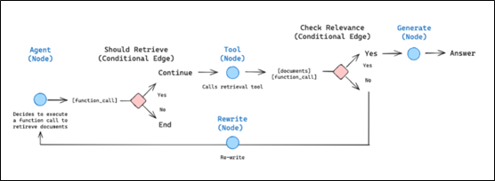

> 读前提示（LangGraph / LangChain 应用视角）
>
> - **适合人群**：已用过 LangChain 或 LLM API，希望把「多步、有状态、可恢复」的 Agent 做成可维护工程的同学。
> - **前置知识**：了解 Python；对「链 / 工具调用 / 消息列表」有基本概念即可。
> - **读完收获**：能说明 LangGraph 解决什么问题、与 LangChain 分工如何，并跑通一个最小的 `StateGraph` 示例。

# 1 LangGraph 是什么

LangGraph 是面向 **长期运行、有状态智能体（agents）** 的编排框架与运行时：把工作流建模为 **图（Graph）**，在节点之间传递 **共享状态**，并原生支持检查点、人机协作与流式输出等生产场景需求。

核心抽象可以概括为三点：

- **节点（Nodes）**：计算单元，例如一次 LLM 调用、工具执行或任意 Python 逻辑。
- **边（Edges）**：控制从一个节点到下一个节点的流转（含条件分支、循环等）。
- **状态（State）**：在整次（或多轮）执行中累积、传递的结构化数据（常见为消息列表 + 自定义字段）。



## 1.1 为何强调「生产级」能力

与「一次性脚本链」不同，真实 Agent 往往需要：

- **持久化与恢复**：进程崩溃或重启后从检查点继续执行。
- **人在回路（Human-in-the-loop）**：在关键步骤暂停、审阅或改写状态后再继续。
- **记忆与上下文**：短期工作记忆与跨会话长期记忆的分层设计。
- **流式与可观测**：token / 事件级输出，便于对接 UI 与 LangSmith 等工具。

LangGraph 可 **单独使用**，也可与 **LangChain**（组件与模型抽象）、**LangSmith**（调试与评测）组合使用。

与 LangChain 中偏「高层链式抽象」不同，LangGraph 更偏 **底层编排**：你显式控制图结构、状态与调度，适合复杂、需精细控制的场景。

**参考链接**

- [LangGraph GitHub](https://github.com/langchain-ai/langgraph)
- [LangGraph 官方文档（概览）](https://docs.langchain.com/oss/python/langgraph/overview)

# 2 为什么需要 LangGraph

应用变复杂后，常见痛点包括：

- 状态散落在全局变量或隐式上下文里，难以测试与复现。
- 线性 `LCEL` 链难以表达 **循环、分支、重试、子图** 等控制流。
- 出错后难以 **从中间步骤恢复**，也不易插入人工审核。

LangGraph 用 **图 + 状态机式运行时** 把这些 concerns 收拢到框架层：执行路径可读、状态可序列化、检查点可回放，更接近「可部署的服务」而非「一次性 demo」。

# 3 典型使用场景

- 多步骤、多分支的 **单智能体** 或 **多智能体** 协作流程。
- 需要 **长期记忆** 或跨轮次累积上下文的对话 / 任务系统。
- 必须 **人工审核、修改状态** 再继续的流程（审批、风控、发布流水线等）。
- 后台长任务与前台流式交互并存的服务。
- 需要 **细粒度控制执行顺序与并行度** 的定制化编排（而非固定 Pipeline）。

# 4 LangGraph 与 LangChain 的差异

二者互补：LangChain 侧重组件与链式组合；LangGraph 侧重 **有状态图执行与运行时**。下表便于快速对照（均为概念层面，具体能力随版本演进请以官方文档为准）。

| 维度       | LangGraph                         | LangChain（典型用法）     |
| ---------- | --------------------------------- | ------------------------- |
| 抽象级别   | 较低，图与状态显式建模            | 较高，链、Agent、工具封装 |
| 状态与记忆 | 状态图 + 检查点等一等公民能力     | 多依赖自行组合与扩展      |
| 执行模型   | 图调度（可循环、条件边）          | 常见为线性或可组合链      |
| 持久化恢复 | 面向检查点、中断恢复的设计        | 需额外工程化              |
| 适用场景   | 复杂有状态工作流、生产 Agent 服务 | 快速原型、标准 RAG/链式   |

# 5 架构与运行时（Pregel 视角）

## 5.1 Pregel 式执行

LangGraph 的运行时可理解为基于 **Pregel/BSP（Bulk Synchronous Parallel）** 思想的图计算：**多轮超步（super-step）**，每轮内调度一批节点，再统一提交状态更新。

一轮大致可分为：

1. **Plan（规划）**：根据当前图与状态，决定本轮要执行的节点。
2. **Execute（执行）**：运行被选中的节点（可并行）。
3. **Update（更新）**：将输出写回 **通道（channels）** / 状态，进入下一轮直至无待执行节点或到达终止条件。

## 5.2 Actor 节点（PregelNode）

节点可视为订阅若干通道、读取输入并写回输出的 **Actor**；在 LangChain 生态中常与 `Runnable` 风格接口衔接，便于复用现有组件。

## 5.3 Channels（通道）

通道是节点之间传递与归约数据的机制，常见类型包括（名称以官方文档为准）：

- **LastValue**：保留最近一次写入的值。
- **Topic**：发布 / 订阅式多生产者场景。
- **BinaryOperatorAggregate**：通过二元运算对多条更新做聚合（如累加、合并字典等）。

# 6 快速入门：环境与最小图

## 6.1 环境

```bash
conda create -n langgraph python=3.12 -y
conda activate langgraph
```

## 6.2 安装

```bash
pip install -U langgraph
pip show langgraph
```

## 6.3 最小可运行示例

下面示例使用内置的 `MessagesState`，定义一个模拟 LLM 的节点，从 `START` 经该节点到 `END`：

```python
from langgraph.graph import END, MessagesState, START, StateGraph


def mock_llm(state: MessagesState):
    """模拟一次 LLM 回复（实际项目中可换成 ChatModel.invoke / stream 等）。"""
    return {"messages": [{"role": "assistant", "content": "hello world"}]}


graph = StateGraph(MessagesState)
graph.add_node("mock_llm", mock_llm)
graph.add_edge(START, "mock_llm")
graph.add_edge("mock_llm", END)

compiled = graph.compile()
response = compiled.invoke({"messages": [{"role": "user", "content": "hi!"}]})
print(response)
```

**说明**

- `add_node` 的第一个参数是 **节点名**，需与 `add_edge` 中字符串一致。
- `compile()` 得到可 `invoke` / `stream` 的可运行对象；后续可在此之上接入检查点、中断与人工节点等高级能力。

# 7 小结与后续阅读

- LangGraph 把 **控制流（图）** 与 **数据流（状态）** 绑在一起，适合构建可维护、可恢复的智能体服务。
- 若你当前链路仍是「线性 Chain」，遇到循环、持久化或人在回路时再引入 LangGraph 往往更自然。
- 下一篇可深入：**状态模式设计、`checkpointer`、条件边与子图**，并与真实 LLM / 工具调用对接。
