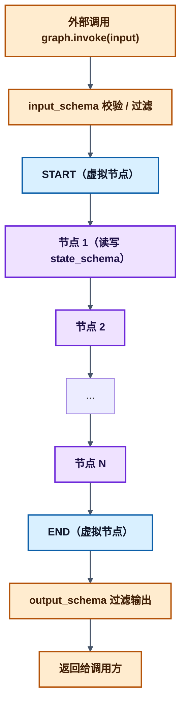
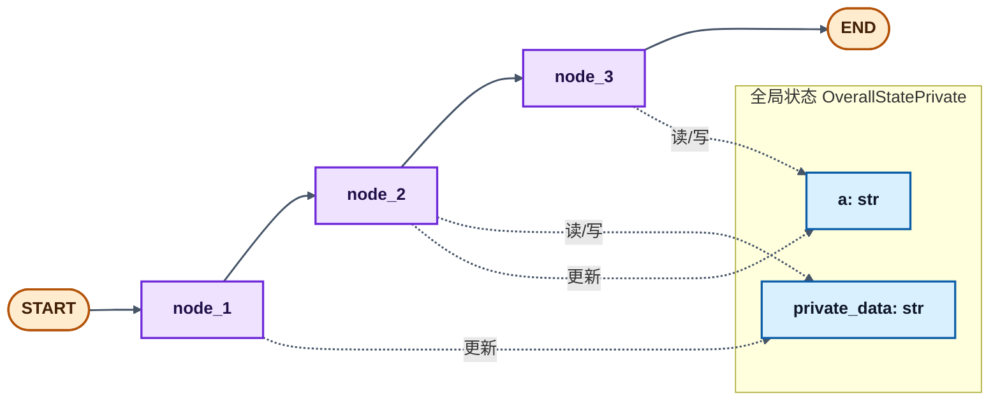

> 读前提示（LangGraph / LangChain 应用视角）
>
> - **适合人群**：要把 Agent 从 demo 做成「可调用、可约束入参出参」服务的开发者。
> - **前置知识**：建议先阅读本系列 [LangGraph 入门](/posts/langgraph-01-langgraph介绍)；熟悉 Python 与 `TypedDict` 更佳。
> - **读完收获**：能独立设计 **内部全量状态** 与 **对外输入/输出契约**，理解节点间如何通过 **State** 协作，并读懂 `compile` / `invoke` 与 Schema 的关系。

# 1 Graph API 在解决什么问题

从核心上看，LangGraph 把智能体工作流建模为 **有向图**。定义行为时主要用到三类构件：

| 构件 | 角色（一句话） |
| --- | --- |
| **State** | 共享数据结构，表示当前「应用快照」；节点读写它，**reducer** 决定如何合并更新。 |
| **Nodes** | 对智能体逻辑编码的函数：读入状态、执行计算或副作用、返回 **部分状态更新**。 |
| **Edges** | 决定下一个执行哪个节点：可以是固定边，也可以是依赖状态的 **条件边**。 |

节点负责「干活」，边负责「下一步去哪」。组合起来即可表达 **循环、分支、多步演化** 等复杂控制流；框架则负责 **状态归约、调度与运行时能力**（如检查点、流式等，见系列前文）。

构建流程可以记为：**定义 `State` → 添加 `Nodes` / `Edges` → `compile()` → `invoke()` / `stream()`**。

**主入口类**：`StateGraph`，由你定义的 **状态类型**（通常为 `TypedDict` 或 Pydantic 模型）参数化。

# 2 State：Schema

## 2.1 如何声明 State

最常见做法是用 **`TypedDict`** 描述图中流转的字段与类型；若需要默认值等能力，可选用 **`dataclass`** / **Pydantic**（以当前 LangGraph 版本文档为准）。

- **Schema**：各节点、边所见的「状态形状」。
- **Reducer**：对同一字段多次更新时如何合并（例如消息列表 **追加** 还是 **覆盖**）。

`State` 的 schema 会成为图内部的 **单一真相来源**；后续 **`input_schema` / `output_schema`** 则是在此之上的 **入站 / 出站视图**。

## 2.2 三层 Schema：state / input / output

下面用一张图概括外部调用与内部状态的关系（`invoke` → 校验入参 → 跑图 → 过滤返回值）：



### `state_schema`（内部全量状态）

- **含义**：运行时 **完整** 的状态结构，是节点之间协作的「总账本」。
- **作用**：
  - 承载 `messages`、`retrieved_docs`、`tool_calls`、迭代计数等 **中间与调试信息**；
  - 与 **reducer** 一起规定字段如何合并；
  - 构建 **`StateGraph`** 时的核心类型参数（常作为第一个位置参数或 `state_schema=`）。
  - `node`输出的字典会自动解析，merge到OverallState

### `input_schema`

- **含义**：调用方 **`invoke` / `stream`** 时 **允许传入** 的字段子集。
- **作用**：
  - 类型与结构校验，拒绝多余或非法字段；
  - **最小暴露**：外部只需传 `user_query`、`session_id` 等，无需了解内部全貌。
- **默认**：未单独指定时，往往与全量 **state** 一致；显式指定后则 **仅允许声明的字段** 从外部注入。

### `output_schema`
- **含义**：执行结束后 **返回给调用方** 的字段子集。
- **作用**：
  - 从全量 state 中 **投影** 出对外可见部分，隐藏中间 Prompt、原始文档、调试日志等；
  - 稳定对外 API，内部状态演进不破坏调用方。
- **默认**：与 **state** 一致；显式指定后 **只返回声明字段**。

### 三者关系与执行顺序（显式分离时）

- **关系**：`input_schema`、`output_schema` 通常是 **`state_schema` 的子集或投影**；未拆分时三者等价。
- **流程**：
  1. **输入**：按 `input_schema` 校验 → 合法字段写入内部 state；
  2. **运行**：节点基于 **全量** `state_schema` 读写；
  3. **输出**：结束时按 `output_schema` 从 state 中取出字段返回。

### 代码示例：显式指定三层 Schema

```python
from typing_extensions import TypedDict
from langgraph.graph import END, START, StateGraph

# 1. 入参：仅外部需要传的字段
class InputState(TypedDict):
    question: str

# 2. 出参：仅对外返回的字段
class OutputState(TypedDict):
    answer: str

# 3. 内部全量状态（可含中间字段）
class OverallState(InputState, OutputState):
    retrieved_docs: list[str]
    tool_call_history: list[dict]
    debug_log: str

builder = StateGraph(OverallState, input_schema=InputState, output_schema=OutputState)

def retrieve_docs(state: OverallState) -> OverallState:
    state["retrieved_docs"] = ["doc1", "doc2"]
    state["debug_log"] = "检索完成"
    return state

def generate_answer(state: OverallState) -> OverallState:
    state["answer"] = f"基于文档：{state['retrieved_docs']}，回答：{state['question']}"
    return state

builder.add_node("retrieve", retrieve_docs)
builder.add_node("generate", generate_answer)
builder.add_edge(START, "retrieve")
builder.add_edge("retrieve", "generate")
builder.add_edge("generate", END)

graph = builder.compile()
result = graph.invoke({"question": "什么是 LangGraph?"})
# 对外通常仅见 output_schema 中的字段，例如 answer
print(result)
```

### 使用三层 Schema 的常见收益

- **数据安全**：中间态不默认对外暴露。
- **接口简洁**：调用方只关心入参 / 出参形状。
- **解耦演进**：内部字段可增删，在不影响 `input_schema` / `output_schema` 的前提下迭代。
- **类型与校验**：减少「多传字段、漏传字段」类运行时问题。

# 3 Input / Output分离：最小示例

下图示意：**`OverallState`** 继承 **`InputState`** 与 **`OutputState`**，节点可仍按整体状态读写，而 **`invoke`** 入参、返回值受 Schema 约束。


```python
"""
演示：input_schema / output_schema 与单节点回答流程。
"""
from typing_extensions import TypedDict
from langgraph.graph import END, START, StateGraph

class InputState(TypedDict):
    question: str

class OutputState(TypedDict):
    answer: str

class OverallState(InputState, OutputState):
    pass

def answer_node(state: InputState):
    """节点侧仍以「入参视图」类型注解接收；框架会注入完整 state 的合法子集。"""
    print("执行 answer_node:")
    print(f"  输入: {state}")
    return OutputState(answer=f"收到问题: {state['question']}，回复: Hello World")

def demo_input_output_schema():
    print("=== 输入 / 输出 Schema 演示 ===")
    builder = StateGraph(OverallState, input_schema=InputState, output_schema=OutputState)
    builder.add_node("answer_node", answer_node)
    builder.add_edge(START, "answer_node")
    builder.add_edge("answer_node", END)
    graph = builder.compile()
    result = graph.invoke({"question": "你好"})
    print(f"图调用结果: {result}")

if __name__ == "__main__":
    demo_input_output_schema()
```

**要点**

- `StateGraph(OverallState, input_schema=..., output_schema=...)` 明确 **对内状态** 与 **对外约束**。
- 节点返回的字典会与 **reducer** 规则合并进全局 state；最终 **`invoke` 返回值** 受 **`output_schema`** 过滤。

# 4 「私有」字段在节点间传递：概念与注意点

下图描述一种常见模式：**某些键只在部分节点之间有意义**，但仍需进入 **全局 `OverallState`** 才能在边上传下去（LangGraph 不会在图外替你维护一套隐形 RAM；可持久化的仍是 **state + checkpointer** 所见的字段）。


实践上请记住：

- 若字段要在 **node_1 → node_2** 间可见，通常必须出现在 **编译时所依据的 state 类型** 中（例如下面的 `OverallStatePrivate`）。
- **类型注解**（如 `Node1Input` / `Node2Input`）多用于 **文档与静态检查**；运行时仍以 **整体 state 的键** 为准。
- 若希望后续节点「看不到」某字段，应在逻辑上 **清空或不再更新** 该键，而不是假设存在框架级「临时内存通道」（除非使用官方提供的专门机制，以文档为准）。

```python
from typing_extensions import TypedDict
from langgraph.graph import END, START, StateGraph

class OverallStatePrivate(TypedDict):
    a: str
    private_data: str

class Node1Input(TypedDict):
    private_data: str

class Node1Output(TypedDict):
    private_data: str

class Node2Input(TypedDict):
    private_data: str

def node_1(state: Node1Input) -> Node1Output:
    output = Node1Output(private_data="由 node_1 设置")
    print("node_1 输入:", state)
    print("node_1 返回:", output)
    return output

def node_2(state: Node2Input):
    print("node_2 输入:", state)
    output = {"a": "由 node_2 设置", "private_data": "由 node_2 设置"}
    print("node_2 返回:", output)
    return output

def node_3(state: OverallStatePrivate) -> OverallStatePrivate:
    print("node_3 输入:", state)
    output = {"a": "由 node_3 设置"}
    print("node_3 返回:", output)
    return output

def demo_private_state():
    print("=== 私有字段在全局 state 中的传递 ===")
    builder = StateGraph(OverallStatePrivate)
    builder.add_node("node_1", node_1)
    builder.add_node("node_2", node_2)
    builder.add_node("node_3", node_3)
    builder.add_edge(START, "node_1")
    builder.add_edge("node_1", "node_2")
    builder.add_edge("node_2", "node_3")
    builder.add_edge("node_3", END)
    graph = builder.compile()
    response = graph.invoke({"a": "初始 a", "private_data": "初始 private_data"})
    print("\n最终状态:", response)

if __name__ == "__main__":
    demo_private_state()
```

**结构简图**（与上文三节点链一致）：



# 5 小结

- **Graph API** 的本质：**`State` + `Nodes` + `Edges`**，再配合 **`compile` / `invoke`** 完成一次运行。
- **`state_schema` / `input_schema` / `output_schema`** 实现 **对内全量状态** 与 **对外最小接口** 的分离，是生产化 Agent 的常用模式。
- **「私有」数据** 在多数实现里仍体现为 **state 中的键**；设计时要明确 **谁在写、谁在读、何时清空**，避免误以为存在未文档化的隐式存储。
* 在 LangGraph 中，节点函数返回的字典，会自动合并（merge）到全局 OverallState 中，规则是：
> 1. 用返回字典里的键名，去匹配 OverallState 里的同名字段
> 2. 用返回字典里的值，覆盖 / 更新全局状态中对应字段的值
> 3. 只有在 OverallState 中已定义的字段，才会被保留；未定义的字段会被直接丢弃

下一篇可继续深入：**`reducer` 自定义、`Annotated` 与消息列表追加、条件边与子图**，并与 **检查点 / 人机中断** 结合。
