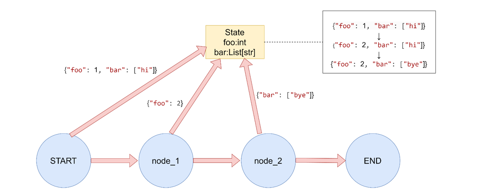
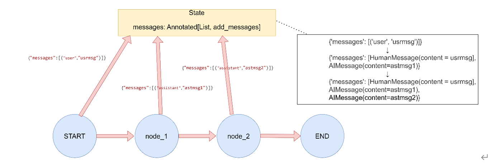
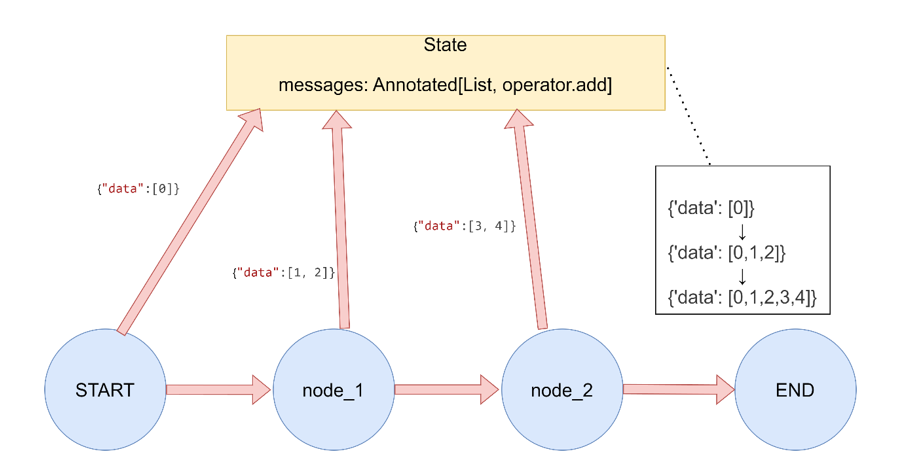
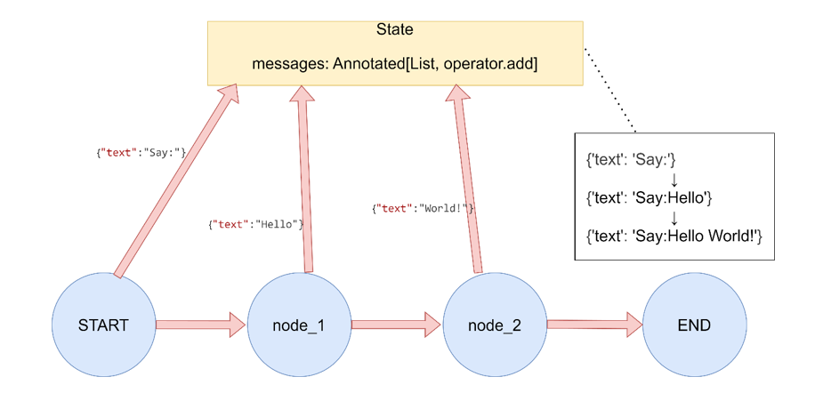
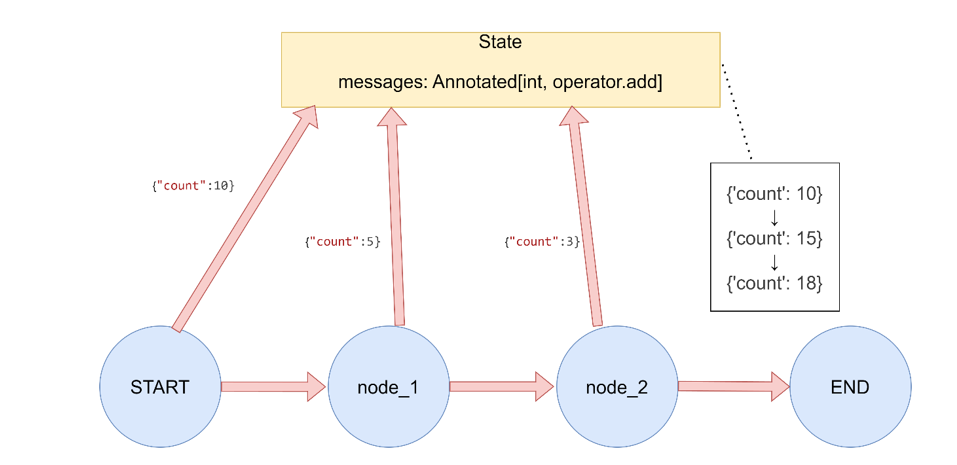
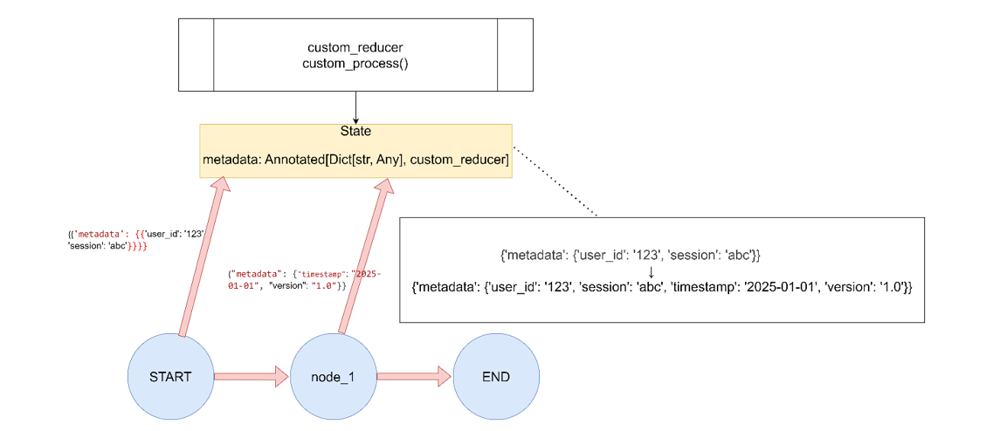

> 读前提示（LangGraph / LangChain 应用视角）
>
> - **适合人群**：已了解 [Graph API 与 State](/posts/langgraph-02-graph-api)，准备在业务里为同一 **State** 字段设计「覆盖 vs 累积」策略的读者。
> - **前置知识**：Python `TypedDict`、`typing.Annotated`；对 **节点返回部分状态更新**、`invoke` 执行流有基本概念。
> - **读完收获**：能正确选用 **默认覆盖**、**`add_messages`**、**`operator.add`** 等；理解并行分支写同一键时 **Reducer** 如何保证合并；知道 **`operator.mul`** 与初始化归约的坑及自定义写法。

# 1 Reducer 是什么

**Reducer** 决定 **State** 中某个键在多次更新时如何合并：节点返回的是 **部分更新**（partial update），框架会把返回值里每个键与当前状态里对应键交给该键配置的 **Reducer** 函数，得到新状态。

一句话：**Reducer** 是「**旧值 + 节点新贡献 → 新值**」的规则；未指定时，该键通常是 **覆盖**（新值替换旧值）。

## 1.1 核心作用

- **控制更新策略**：在「覆盖」之外，支持 **追加、累加、去重、聚合** 等。
- **消解并行写冲突**：多个节点并行、同时更新同一键时，由 **Reducer** 定义合并语义，避免竞态下语义不清。
- **典型累积场景**：多轮对话里用 **`add_messages`** 或 **`operator.add`** 维护 **消息列表**，避免后一轮覆盖上一轮。
- **复杂业务**：自定义函数可实现去重、条件合并、字典深度合并等。

## 1.2 类型签名

Python 侧可理解为二元归约：

```python
(current_value: T, new_value: T) -> T
```

- **`current_value`**：当前状态中该键已有值。
- **`new_value`**：当前节点返回的更新中该键的贡献（可能与 `current_value` 同型，也可能为「片段」，具体以文档与实现为准）。
- **返回值**：合并后的新值；通常应 **返回新对象**、**不修改** 入参。合并后类型需与 **State** 声明一致。

# 2 常用内置与约定

未为某键指定 **Reducer** 时，行为是 **覆盖**：节点返回该键则整键替换；若返回里 **未出现** 某键，则该键保持原状（不是「追加新键」意义上的 append，而是「未触碰则不变」）。

常见选项如下。

| 方式 | 行为概要 | 典型场景 |
| --- | --- | --- |
| **默认（无 Reducer）** | 覆盖更新 | 标量配置、单次结论字段 |
| **`langgraph.graph.message.add_messages`** | 消息列表智能合并（含 LangChain 消息语义） | 多轮对话 **`messages`** |
| **`operator.add`** | 列表拼接、字符串拼接、数值相加 | 日志列表、标签累加、计数 |
| **`operator.or_` / `operator.and_`** | 按位或 / 与（常用于布尔标志） | 错误位、多条件与或 |
| **自定义可调用对象** | 任意 `(left, right) -> merged` | 字典合并、业务级归约 |

## 2.1 价值小结

- **并行友好**：多分支写同一键时，由 **Reducer** 统一语义，减少手写锁与合并代码。
- **可预测**：合并规则显式，便于调试与回放。
- **适配 Agent**：多工具、多智能体协作时，**State** 往往需要 **累积型** 字段，**Reducer** 是基础设施。

# 3 使用方式与示例

## 3.1 默认覆盖

未使用 **`Annotated[..., reducer]`** 时，对该键的更新为 **覆盖**：节点返回 `{"foo": 2}` 则 **`foo`** 变为 `2`，与之前值无关。

若某键在初始 **`invoke` 输入** 中已有值，而后续节点未返回该键，则该键 **保持不变**。若节点返回了新键，则 **并入** **State**（这是「返回字典里有什么键」层面的合并，与 **Reducer** 的「同键如何合并」是两层概念）。



```python
"""
LangGraph Reducer函数演示 - 默认Reducer（覆盖更新）
"""

from typing import List
from typing_extensions import TypedDict
from langgraph.graph import StateGraph, START, END

# 1. 默认Reducer（覆盖更新）
# 图的全局状态
class DefaultReducerState(TypedDict):
    foo: int
    bar: List[str]

def node_default_1(state: DefaultReducerState) -> dict:
    return {"foo": 2}

def node_default_2(state: DefaultReducerState) -> dict:
    return {"bar": ["bye"]}

def run_demo():
    print("1. 默认Reducer（覆盖更新）演示:")
    builder = StateGraph(DefaultReducerState)
    builder.add_node("node1", node_default_1)
    builder.add_node("node2", node_default_2)
    builder.add_edge(START, "node1")
    builder.add_edge("node1", "node2")
    builder.add_edge("node2", END)
    graph = builder.compile()
    
    result = graph.invoke({"foo": 1, "bar": ["hi"]})
    print(f"初始状态: {{'foo': 1, 'bar': ['hi']}}")
    print(f"执行结果: {result}\n")

if __name__ == "__main__":
    run_demo()

```

## 3.2 `add_messages`

专门用于 **消息列表**：使用 **`add_messages`** 后，条目会按 LangChain **消息** 语义处理（如 **`HumanMessage`**、**`AIMessage`** 等）。



```python
"""
LangGraph Reducer函数演示 - add_messages Reducer（消息列表专用）
"""

from typing import Annotated, List
from typing_extensions import TypedDict
from langgraph.graph import StateGraph, START, END
from langgraph.graph.message import add_messages

# 2. add_messages Reducer（消息列表专用）
class AddMessagesState(TypedDict):
    # 通过Annotated，将add_messages作为Reducer函数，作用于messages字段
    messages: Annotated[List, add_messages]

def chat_node_1(state: AddMessagesState) -> dict:
    return {"messages": [("assistant", "Hello from node 1")]}

def chat_node_2(state: AddMessagesState) -> dict:
    return {"messages": [("assistant", "Hello from node 2")]}

def run_demo():
    print("2. add_messages Reducer（消息列表专用）演示:")
    builder = StateGraph(AddMessagesState)
    builder.add_node("chat1", chat_node_1)
    builder.add_node("chat2", chat_node_2)
    builder.add_edge(START, "chat1")
    builder.add_edge(START, "chat2")  # 并行：两路同时从 START 出发
    builder.add_edge("chat1", END)
    builder.add_edge("chat2", END)
    graph = builder.compile()
    
    result = graph.invoke({"messages": [("user", "Hi there!")]})
    print(f"初始状态: {{'messages': [('user', 'Hi there!')]}}")
    print(f"执行结果: {result}\n")

if __name__ == "__main__":
    run_demo()
```

> **并行提示**：从 **`START`** 连出多条边时，各分支可能被 **并发调度**；**消息的最终顺序** 由 **`add_messages`** 的合并规则保证。业务上不要依赖「哪一个节点先跑完」，若需要严格顺序，应在后续节点或 **Reducer** 中显式整理。

## 3.3 `operator.add`

将 **新值** 与 **旧值** 做 **`+`**：**列表** 为拼接，**字符串** 为连接，**数值** 为相加。

### 列表追加



```python
"""
LangGraph Reducer函数演示 - operator.add Reducer（列表追加）
"""

import operator
from typing import Annotated, List
from typing_extensions import TypedDict
from langgraph.graph import StateGraph, START, END

# 3. operator.add Reducer（列表追加）
class ListAddState(TypedDict):
    data: Annotated[List[int], operator.add]

def producer_1(state: ListAddState) -> dict:
    return {"data": [1, 2]}

def producer_2(state: ListAddState) -> dict:
    return {"data": [3, 4]}

def run_demo():
    print("3.1 operator.add Reducer（列表追加）演示:")
    builder = StateGraph(ListAddState)
    builder.add_node("producer1", producer_1)
    builder.add_node("producer2", producer_2)
    builder.add_edge(START, "producer1")
    builder.add_edge(START, "producer2")  # 并行执行
    builder.add_edge("producer1", END)
    builder.add_edge("producer2", END)
    graph = builder.compile()
    
    result = graph.invoke({"data": [0]})
    print(f"初始状态: {{'data': [0]}}")
    print(f"执行结果: {result}\n")

if __name__ == "__main__":
    run_demo()
```

### 字符串拼接



```python
"""
LangGraph Reducer函数演示 - 字符串连接Reducer
"""

import operator
from typing import Annotated
from typing_extensions import TypedDict
from langgraph.graph import StateGraph, START, END

# 6. 字符串连接Reducer
class StringConcatState(TypedDict):
    text: Annotated[str, operator.add]

def add_text_1(state: StringConcatState) -> dict:
    return {"text": "Hello "}

def add_text_2(state: StringConcatState) -> dict:
    return {"text": "World!"}

def run_demo():
    print("3.2 字符串连接Reducer演示:")
    builder = StateGraph(StringConcatState)
    builder.add_node("add_text_1", add_text_1)
    builder.add_node("add_text_2", add_text_2)
    builder.add_edge(START, "add_text_1")
    builder.add_edge(START, "add_text_2")  # 并行执行
    builder.add_edge("add_text_1", END)
    builder.add_edge("add_text_2", END)
    graph = builder.compile()
    
    result = graph.invoke({"text": "Say: "})
    print(f"初始状态: {{'text': 'Say: '}}")
    print(f"执行结果: {result}\n")

if __name__ == "__main__":
    run_demo()
```

### 数值累加



```python
"""
LangGraph Reducer函数演示 - 数值累加Reducer
"""

import operator
from typing import Annotated
from typing_extensions import TypedDict
from langgraph.graph import StateGraph, START, END

# 7. 数值累加Reducer
class NumberAddState(TypedDict):
    count: Annotated[int, operator.add]

def increment_1(state: NumberAddState) -> dict:
    return {"count": 5}

def increment_2(state: NumberAddState) -> dict:
    return {"count": 3}

def run_demo():
    print("3.3 数值累加Reducer演示:")
    builder = StateGraph(NumberAddState)
    builder.add_node("increment_1", increment_1)
    builder.add_node("increment_2", increment_2)
    builder.add_edge(START, "increment_1")
    builder.add_edge(START, "increment_2")  # 并行执行
    builder.add_edge("increment_1", END)
    builder.add_edge("increment_2", END)
    graph = builder.compile()
    
    result = graph.invoke({"count": 10})
    print(f"初始状态: {{'count': 10}}")
    print(f"执行结果: {result}\n")

if __name__ == "__main__":
    run_demo()
```

## 3.4 `operator.mul` 与初始化行为

对 **数值** 做乘法归约时，**`operator.mul`** 在 **图初始化** 阶段可能会用 **类型默认值**（如 **`float`** 的 **`0.0`**）与 **`invoke` 传入的初值** 先做一次归约，从而出现「先被乘成 0」等现象；版本与运行时细节以官方文档为准。生产里若需 **纯乘法链**，更稳妥的是 **自定义 Reducer** 或显式处理 **第一次** 更新。

```python
"""
LangGraph Reducer函数演示 - operator.mul Reducer（数值相乘）
"""

import operator
from typing import Annotated
from typing_extensions import TypedDict
from langgraph.graph import StateGraph, START, END

# 4. operator.mul Reducer（数值相乘）
class MultiplyState(TypedDict):
    factor: Annotated[float, operator.mul]

def multiplier(state: MultiplyState) -> dict:
    return {"factor": 2.0}

def run_demo():
    """
    注意：部分版本/场景下，初始化阶段可能对默认值与 invoke 初值多做一次 mul，
    导致结果不符合「仅从初值开始连乘」的直觉；请用自定义 reducer 或查阅当前版本文档。
    """
    print("4. operator.mul Reducer（数值相乘）演示:")
    builder = StateGraph(MultiplyState)
    builder.add_node("multiplier", multiplier)
    builder.add_edge(START, "multiplier")
    builder.add_edge("multiplier", END)
    graph = builder.compile()

    result = graph.invoke({"factor": 5.0})
    print(f"初始状态: {{'factor': 5.0}}")
    print(f"执行结果: {result}\n")

if __name__ == "__main__":
    run_demo()
```

## 3.5 自定义 Reducer

合并逻辑完全由你实现，例如 **字典浅合并**（新键覆盖旧键同名字段）：



```python
"""
LangGraph Reducer函数演示 - 自定义Reducer函数
"""

from typing import Annotated, Dict, Any
from typing_extensions import TypedDict
from langgraph.graph import StateGraph, START, END

# 5. 自定义Reducer函数
def custom_reducer(current_value: Dict[str, Any], new_value: Dict[str, Any]) -> Dict[str, Any]:
    """合并两个字典，新值会覆盖旧值，但保留旧值中不存在的键"""
    result = current_value.copy()
    result.update(new_value)
    return result

class CustomReducerState(TypedDict):
    metadata: Annotated[Dict[str, Any], custom_reducer]

def update_metadata(state: CustomReducerState) -> dict:
    return {"metadata": {"timestamp": "2026-01-01", "version": "1.0"}}

def run_demo():
    print("5. 自定义Reducer演示:")
    builder = StateGraph(CustomReducerState)
    builder.add_node("update_metadata", update_metadata)
    builder.add_edge(START, "update_metadata")
    builder.add_edge("update_metadata", END)
    graph = builder.compile()
    
    result = graph.invoke({"metadata": {"user_id": "123", "session": "abc"}})
    print(f"初始状态: {{'metadata': {{'user_id': '123', 'session': 'abc'}}}}")
    print(f"执行结果: {result}\n")

if __name__ == "__main__":
    run_demo()
```

### 自定义乘法归约（规避初始化问题）

下面用 **全局标志** 区分「初始化路径」与「节点更新」，仅为演示；多图并发时全局变量 **不安全**，生产环境请改用 **闭包工厂** 或 **可实例化的 Reducer 对象**，保证每份图有独立状态。

```python
"""
LangGraph Reducer函数演示 - 自定义 mul reducer 实现数值相乘
使用全局变量区分初始化调用和正常调用
"""

from typing import Annotated
from typing_extensions import TypedDict
from langgraph.graph import StateGraph, START, END

# 使用全局变量来跟踪是否是第一次调用（初始化阶段）
_is_initial_call = True

def my_mul_reducer(current_value: float, new_value: float) -> float:
    """
    自定义乘法reducer，使用全局变量区分初始化调用和正常调用
    
    Args:
        current_value: 当前状态值
        new_value: 新值
        
    Returns:
        计算后的结果
    """
    global _is_initial_call
    
    print(f"Reducer被调用: current_value={current_value}, new_value={new_value}, is_initial_call={_is_initial_call}")
    
    # 如果是初始化调用，直接返回new_value，避免默认值0的影响
    if _is_initial_call:
        _is_initial_call = False  # 重置标志
        return new_value
    else:
        # 正常的乘法操作，包括乘以0的情况
        return current_value * new_value

class MultiplyState(TypedDict):
    factor: Annotated[float, my_mul_reducer]

# 节点1：将factor乘以2
def multiplier_by_two(state: MultiplyState) -> dict:
    """将factor乘以2"""
    return {"factor": 2.0}

# 节点2：将factor乘以0
def multiplier_by_zero(state: MultiplyState) -> dict:
    """将factor乘以0"""
    return {"factor": 0.0}

def run_demo():
    """
    演示增强版乘法reducer的使用
    """
    global _is_initial_call
    
    print("=== operator.mul 增强版解决方案演示 ===\n")
    
    # 演示1: 正常乘法操作
    print("1. 正常乘法操作演示:")
    _is_initial_call = True  # 重置初始化标志
    builder = StateGraph(MultiplyState)
    builder.add_node("multiplier_by_two", multiplier_by_two)
    builder.add_edge(START, "multiplier_by_two")
    builder.add_edge("multiplier_by_two", END)
    graph = builder.compile()

    result = graph.invoke({"factor": 5.0})
    print(f"初始状态: {{'factor': 5.0}}")
    print(f"执行结果: {result}")
    print(f"预期结果: 10.0 (5.0 * 2.0)\n")
    
    # 演示2: 乘以0的操作
    print("2. 乘以0的操作演示:")
    _is_initial_call = True  # 重置初始化标志
    builder2 = StateGraph(MultiplyState)
    builder2.add_node("multiplier_by_zero", multiplier_by_zero)
    builder2.add_edge(START, "multiplier_by_zero")
    builder2.add_edge("multiplier_by_zero", END)
    graph2 = builder2.compile()

    result2 = graph2.invoke({"factor": 5.0})
    print(f"初始状态: {{'factor': 5.0}}")
    print(f"执行结果: {result2}")
    print(f"预期结果: 0.0 (5.0 * 0.0)\n")
    
    # 演示3: 连续乘法操作
    print("3. 连续乘法操作演示:")
    _is_initial_call = True  # 重置初始化标志
    builder3 = StateGraph(MultiplyState)
    builder3.add_node("multiplier_by_two_1", multiplier_by_two)
    builder3.add_node("multiplier_by_zero", multiplier_by_zero)
    builder3.add_node("multiplier_by_two_2", multiplier_by_two)
    
    builder3.add_edge(START, "multiplier_by_two_1")
    builder3.add_edge("multiplier_by_two_1", "multiplier_by_zero")
    builder3.add_edge("multiplier_by_zero", "multiplier_by_two_2")
    builder3.add_edge("multiplier_by_two_2", END)
    
    graph3 = builder3.compile()

    result3 = graph3.invoke({"factor": 3.0})
    print(f"初始状态: {{'factor': 3.0}}")
    print(f"执行结果: {result3}")
    print(f"预期过程: 3.0 -> 6.0 -> 0.0 -> 0.0")
    print(f"预期结果: 0.0\n")

if __name__ == "__main__":
    run_demo()

```

# 4 综合示例：多字段协同

同一 **State** 里可同时为不同键配置不同 **Reducer**（例如 **`messages`** 用 **`add_messages`**，**`tags`** 用 **`operator.add`**）。

```python
from typing import Annotated, List
from typing_extensions import TypedDict
from langgraph.graph import StateGraph, START, END
from langgraph.graph.message import add_messages
import operator

class ChatState(TypedDict):
    messages: Annotated[list, add_messages]  # 消息历史
    tags: Annotated[List[str], operator.add]  # 标签列表
    score: Annotated[float, operator.add]     # 累计分数

def process_user_message(state: ChatState) -> dict:
    user_message = state["messages"][-1]
    return {
        "messages": [("assistant", f"Echo: {user_message.content}")],
        "tags": ["processed"],
        "score": 1.0
    }

def add_sentiment_tag(state: ChatState) -> dict:
    return {
        "tags": ["positive"],
        "score": 0.5
    }

# 构建图
builder = StateGraph(ChatState)
builder.add_node("process", process_user_message)
builder.add_node("sentiment", add_sentiment_tag)

builder.add_edge(START, "process")
builder.add_edge(START, "sentiment")
builder.add_edge("process", END)
builder.add_edge("sentiment", END)

graph = builder.compile()

# 使用示例：OpenAI 风格消息字典会被规范化为消息对象
result = graph.invoke({
    "messages": [{"role": "user", "content": "Hello, how are you?"}],
    "tags": ["greeting"],
    "score": 0.0
})

print(result)
```

**小结**：为每个需要 **累积** 或 **特殊合并** 的字段选好 **Reducer**，并行分支下语义才清晰；默认 **覆盖** 适合「每次只想保留最新值」的键。
> Reducer函数在LangGraph中的作用：
> * 控制状态更新方式：决定新值如何与现有值合并。
> * 处理并行更新：当多个节点同时更新同一字段时，确保数据一致性。
> * 提供灵活性：支持不同的合并策略，如覆盖、追加、相加等。
> * 增强表达力：允许开发者根据业务需求自定义合并逻辑。
> 
通过合理使用Reducer函数，可以构建更强大和灵活的状态管理机制，特别是在处理复杂工作流和并行执行场景时。
