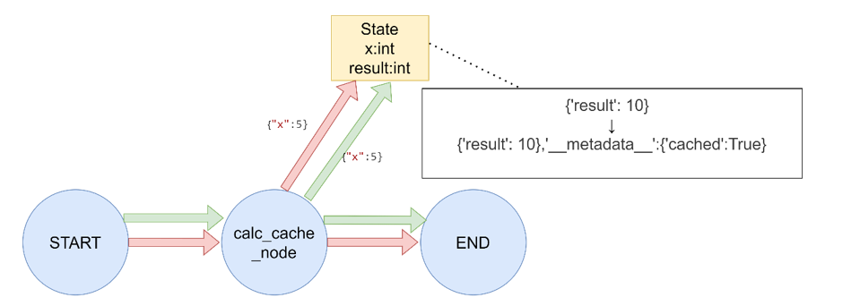
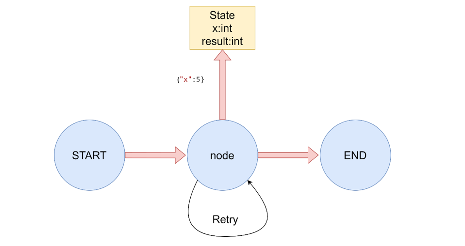
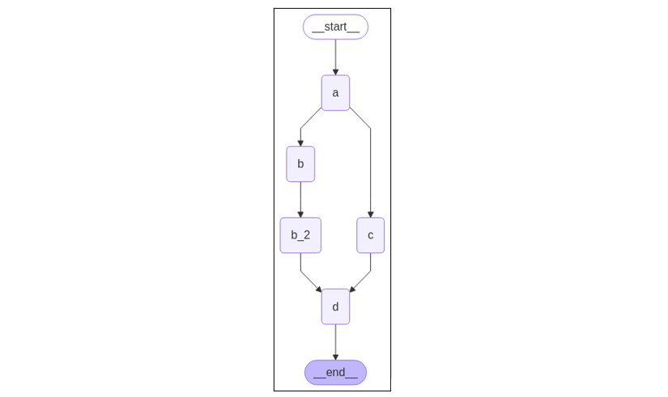
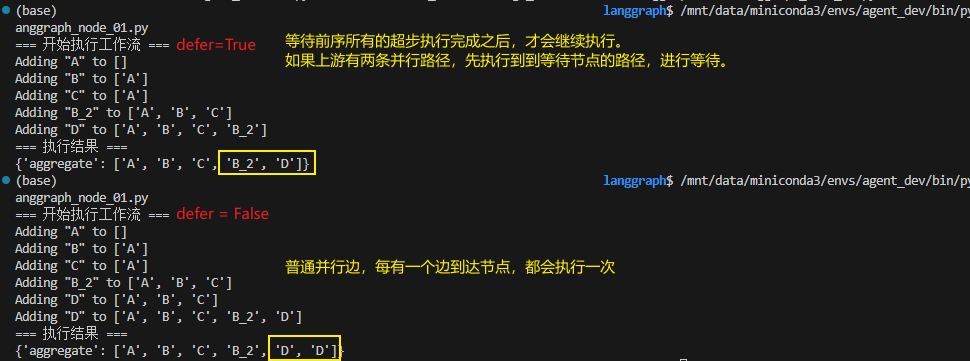
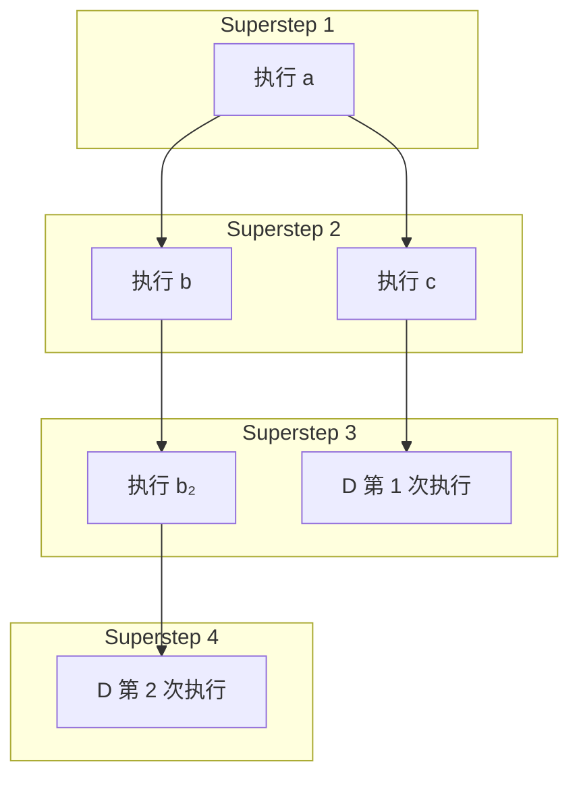
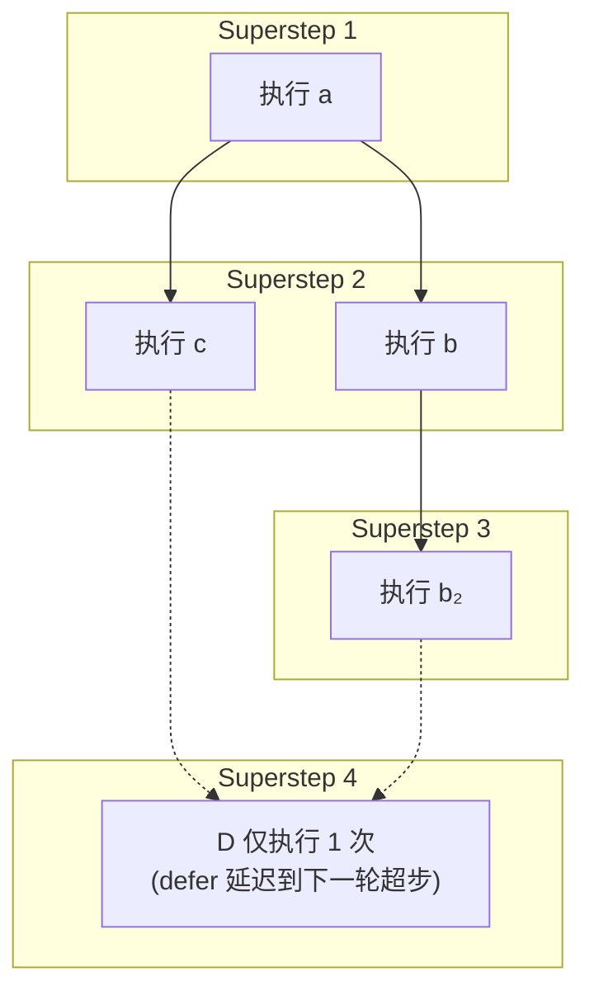
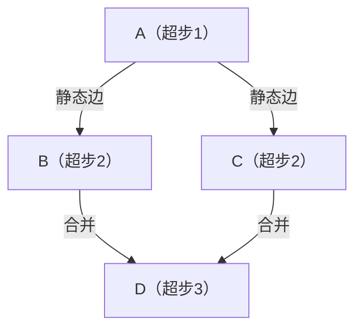
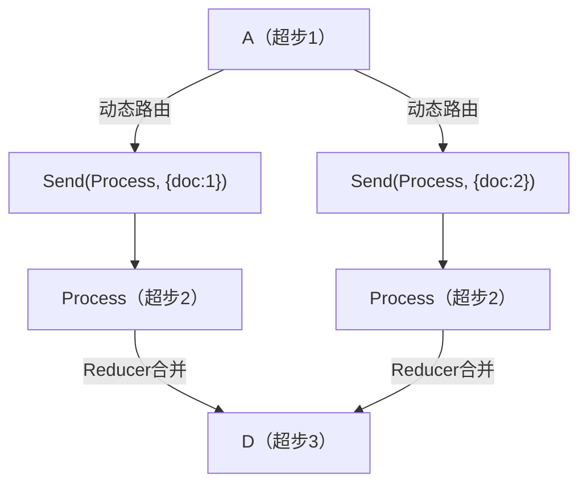

> 读前提示（LangGraph / LangChain 应用视角）
>
> - **适合人群**：已了解 [Graph API 与 State](/posts/langgraph-02-graph-api)、[Reducer 与状态合并](/posts/langgraph-03-reducer)，准备在真实工作流里为 **节点** 配置缓存、重试与并行语义的读者。
> - **前置知识**：**`StateGraph.add_node`**、**`invoke` / `stream`**；对 **TypedDict** 状态与 **Reducer**（如 **`operator.add`**）有基本概念更佳。
> - **读完收获**：能正确使用 **`CachePolicy` / `InMemoryCache`**、**`RetryPolicy`**；理解 **`defer=True`** 与 **多入边** 下节点触发次数的差异；会用 **`Send`** 做动态并行，并区分 **静态扇出** 与 **Send 动态扇出**；建立 **超步（superstep）** 调度直觉。

# 1 节点是什么：`add_node` 与可注入参数

在 **LangGraph** 中，**节点（Node）**本质上是普通 Python 可调用对象（支持同步或 **`async`**）。编译与执行时，框架会按**函数签名**注入依赖，常见包括：

- **`state`**：当前 **图状态**（通常对应你声明的 **State** / **`TypedDict`**）。
- **`config`**：**`RunnableConfig`**，例如 **`thread_id`**、用于追踪的 **`tags`** 等。
- **`runtime`**：**`Runtime`**，可拿到 **`store`**、**`stream_writer`** 等与运行期能力相关的句柄。

并非每个节点都要声明以上全部参数；只写你需要的即可。定义好节点函数后，通过 **`StateGraph.add_node`** 注册到图中。若添加时未显式指定名称，框架会使用与**函数名相同**的默认节点名。

## 1.1 `START` 与 `END`

- **`START`**：特殊节点，表示**用户输入进入图**的入口侧。在连边时引用它，是为了声明「从图外进入后，首先调度哪些节点」。
- **`END`**：特殊节点，表示**执行终止**。当某条路径「走到 **`END`**」时，表示该路径上不再有后续节点。

# 2 节点缓存（Node Caching）

**LangGraph** 支持在**节点输入**维度对节点执行结果做缓存。要点有两步：

1. **编译图时**传入缓存后端（例如 **`InMemoryCache()`**），或在等价 API 中指定缓存与入口配置（以当前版本文档为准）。
2. 在 **`add_node(..., cache_policy=CachePolicy(...))`** 上为单个节点声明策略。

每个 **`CachePolicy`** 通常关注：

- **`key_func`**：由节点输入生成缓存键；默认往往是对输入做 **pickle 再哈希**（具体行为以版本为准）。
- **`ttl`**：缓存存活秒数；不指定则**不过期**（直到被逐出或进程结束，取决于缓存实现）。



```python
import time
from typing_extensions import TypedDict
from langgraph.graph import StateGraph
from langgraph.cache.memory import InMemoryCache
from langgraph.types import CachePolicy

# 定义状态
class State(TypedDict):
    x: int
    result: int

# 创建图
builder = StateGraph(State)

# 定义节点
def expensive_node(state: State) -> dict[str, int]:
    # expensive computation
    time.sleep(2)
    return {"result": state["x"] * 2}

# 添加节点，并设置缓存策略
# 添加节点的时候，设置缓存策略
builder.add_node("expensive_node", expensive_node, cache_policy=CachePolicy(ttl=3)) 
# 设置入口和出口
builder.set_entry_point("expensive_node")
builder.set_finish_point("expensive_node")

# 编译图
# 指定缓存的位置
graph = builder.compile(cache=InMemoryCache())

# 执行图
print(graph.invoke({"x": 5}, stream_mode='updates'))
# [{'expensive_node': {'result': 10}}]
# 第二次运行利用缓存并快速返回
print(graph.invoke({"x": 5}, stream_mode='updates'))
# [{'expensive_node': {'result': 10}, '__metadata__': {'cached': True}}]

```

- 对**相同输入**的重复计算，若缓存命中，可直接返回缓存结果（示例中第二次 **`invoke`** 的元数据里会出现 **`cached: True`**）。

# 3 为节点添加重试：`RetryPolicy`

在调用外部 **API**、访问数据库或调用 **LLM** 等场景，往往需要为节点配置**重试策略**。在 **`add_node`** 中使用 **`retry_policy`**，传入 **`RetryPolicy`**（命名元组 / 配置对象，以当前类型名为准）。

默认的 **`retry_on`** 会对**多数异常**触发重试，但通常**不会**对以下类型重试（语义是「这类错误重试多半无意义」）：

- **`ValueError`**
- **`TypeError`**
- **`ArithmeticError`**
- **`ImportError`**
- **`LookupError`**
- **`NameError`**
- **`SyntaxError`**
- **`RuntimeError`**
- **`ReferenceError`**
- **`StopIteration`**
- **`StopAsyncIteration`**
- **`OSError`**

具体列表以你所用的 **LangGraph** 版本源码 / 文档为准。



```python
"""
LangGraph 节点重试策略演示
"""

import random
from typing import Dict, Any
from typing_extensions import TypedDict
from langgraph.graph import StateGraph, START, END
from langgraph.types import RetryPolicy

# 定义状态
class State(TypedDict):
    result: str

# 模拟不稳定的API调用，使用全局变量跟踪尝试次数
attempt_counter = 0

def unstable_api_call(state: State) -> Dict[str, Any]:
    """
    模拟一个不稳定的API调用，有一定概率失败
    """
    global attempt_counter
    attempt_counter += 1
    print(f"尝试调用API，这是第 {attempt_counter} 次尝试")
    
    # 模拟前几次尝试失败，最后一次成功
    if attempt_counter < 3:
        raise Exception(f"模拟API调用失败 (尝试 {attempt_counter})")
    else:
        # 第三次尝试成功
        return {
            "result": f"API调用成功，经过 {attempt_counter} 次尝试"
        }

# 自定义重试策略
def custom_retry_on(exception: Exception) -> bool:
    """
    自定义重试条件：只对特定错误进行重试
    """
    # 只对包含"模拟API调用失败"的异常进行重试
    if "模拟API调用失败" in str(exception):
        print(f"捕获到可重试异常: {exception}")
        return True
    
    # 对其他异常不重试
    print(f"捕获到不可重试异常: {exception}")
    return False

# 模拟抛出 ValueError 的节点
def value_error_call(state: State) -> Dict[str, Any]:
    """
    模拟抛出 ValueError 的节点（不会被默认重试策略重试）
    """
    print("调用会抛出 ValueError 的节点")
    raise ValueError("模拟 ValueError 异常")

def run_demo():
    print("=== LangGraph 节点重试策略演示 ===\n")
    
    # 重置全局计数器
    global attempt_counter
    attempt_counter = 0
    
    # 演示1: 使用默认重试策略
    print("1. 使用默认重试策略:")
    print("   默认策略会对除特定异常外的所有异常进行重试")
    print("   不会重试的异常包括: ValueError, TypeError, ArithmeticError, ImportError,")
    print("                     LookupError, NameError, SyntaxError, RuntimeError,")
    print("                     ReferenceError, StopIteration, StopAsyncIteration, OSError\n")
    
    builder1 = StateGraph(State)
    
    # 添加节点，使用默认重试策略
    builder1.add_node(
        "unstable_call", 
        unstable_api_call, 
        retry_policy=RetryPolicy(max_attempts=5)  # 允许最多5次尝试,采用默认的重试策略
    )
    
    builder1.add_edge(START, "unstable_call")
    builder1.add_edge("unstable_call", END)
    
    graph1 = builder1.compile()
    
    print("测试默认重试策略:")
    try:
        result = graph1.invoke({"result": ""})
        print(f"最终结果: {result}\n")
    except Exception as e:
        print(f"最终失败: {type(e).__name__}: {e}\n")
    
    # 演示2: 使用自定义重试策略
    print("2. 使用自定义重试策略:")
    print("   自定义策略只对特定错误进行重试\n")
    
    # 重置全局计数器
    attempt_counter = 0
    
    builder2 = StateGraph(State)
    
    # 添加节点，使用自定义重试策略
    builder2.add_node(
        "custom_retry_call", 
        unstable_api_call, 
        retry_policy=RetryPolicy(max_attempts=5, retry_on=custom_retry_on)
    )
    
    builder2.add_edge(START, "custom_retry_call")
    builder2.add_edge("custom_retry_call", END)
    
    graph2 = builder2.compile()
    
    print("测试自定义重试策略:")
    try:
        result = graph2.invoke({"result": ""})
        print(f"最终结果: {result}\n")
    except Exception as e:
        print(f"最终失败: {type(e).__name__}: {e}\n")
    
    # 演示3: 不会重试的异常类型
    print("3. 测试不会重试的异常类型:")
    
    builder3 = StateGraph(State)
    
    # 添加节点，使用默认重试策略
    builder3.add_node(
        "value_error_call", 
        value_error_call, 
        retry_policy=RetryPolicy(max_attempts=3)
    )
    
    builder3.add_edge(START, "value_error_call")
    builder3.add_edge("value_error_call", END)
    
    graph3 = builder3.compile()
    
    print("测试 ValueError（默认策略不会重试）:")
    try:
        result = graph3.invoke({"result": ""})
        print(f"最终结果: {result}\n")
    except Exception as e:
        print(f"最终失败: {type(e).__name__}: {e}\n")

if __name__ == "__main__":
    run_demo()
```

# 4 延迟节点执行：`defer=True`

**延迟执行**指：把某个节点的调度**推迟到当前这一轮可并行任务都处理完**之后，再运行。它特别适合「多条分支长度不同、但需要**汇聚后再算一次**」的图。



```python
"""
LangGraph 延迟节点执行演示

本示例展示了如何使用defer=True来实现节点延迟执行，确保该节点等待所有其他并行分支任务完成后才执行。
"""

import operator
from typing import Annotated, Any
from typing_extensions import TypedDict
from langgraph.graph import StateGraph, START, END


class State(TypedDict):
    """
    状态类型定义
    
    aggregate: 使用operator.add reducer使这个列表为追加模式，确保每个节点的结果都能被正确合并
    """
    # The operator.add reducer fn makes this append-only
    aggregate: Annotated[list, operator.add]

def a(state: State):
    """
    节点a：启动分支
    
    此节点是工作流的起点，负责初始化流程并分发到不同的分支。
    
    Args:
        state: 当前状态
    
    Returns:
        dict: 包含新结果的状态更新
    """
    print(f'Adding "A" to {state["aggregate"]}')
    return {"aggregate": ["A"]}

def b(state: State):
    """
    节点b：第一个分支
    
    此节点处理第一个分支的任务，与节点c并行执行。
    
    Args:
        state: 当前状态
    
    Returns:
        dict: 包含新结果的状态更新
    """
    print(f'Adding "B" to {state["aggregate"]}')
    return {"aggregate": ["B"]}

def b_2(state: State):
    """
    节点b2：第二个分支
    
    此节点处理第二个分支的任务，在节点b完成后执行。
    
    Args:
        state: 当前状态
    
    Returns:
        dict: 包含新结果的状态更新
    """
    print(f'Adding "B_2" to {state["aggregate"]}')
    return {"aggregate": ["B_2"]}

def c(state: State):
    """
    节点c：另一个分支
    
    此节点处理另一个分支的任务，与节点b并行执行。
    
    Args:
        state: 当前状态
    
    Returns:
        dict: 包含新结果的状态更新
    """
    print(f'Adding "C" to {state["aggregate"]}')
    return {"aggregate": ["C"]}

def d(state: State):
    """
    节点d：延迟执行的汇总节点
    
    此节点设置了defer=True，因此会等待所有其他任务完成后才执行。
    它负责汇总所有分支的结果。
    
    Args:
        state: 当前状态
    
    Returns:
        dict: 包含新结果的状态更新
    """
    print(f'Adding "D" to {state["aggregate"]}')
    return {"aggregate": ["D"]}

# 创建图
builder = StateGraph(State)

# 添加节点
builder.add_node("a", a)
builder.add_node("b", b)
builder.add_node("b_2", b_2)
builder.add_node("c", c)
builder.add_node("d", d, defer=True)  # 设置defer=True延迟执行

# 添加边
builder.add_edge(START, "a")
builder.add_edge("a", "b")
builder.add_edge("a", "c")
builder.add_edge("b", "b_2")
builder.add_edge("b_2", "d")
builder.add_edge("c", "d")
builder.add_edge("d", END)

# 编译图
graph = builder.compile()

# 执行图
print("=== 开始执行工作流 ===")
result = graph.invoke({})
print("=== 执行结果 ===")
print(result)
```



调度直觉（与 **超步** 概念一致，见下文）：

- **默认行为**：对**多入边**节点，常见语义是「**每条已完成的入边**都可能触发一次调度」（是否合并为一次取决于引擎与 **`defer`** 等配置；下面用示意图展示 **`defer`** 的作用）。
- **`defer=True`**：把该节点**推迟**到「当前 **superstep** 内其它待运行任务都结束后」再进入下一轮调度，从而避免「分支未齐就提前跑汇聚节点」的问题。

> **一个 superstep** ≈ 引擎收集一批可运行节点 → 并发执行 → 等这一批全部结束，再进入下一轮。
>
> - 普通节点：通常参与**当前 superstep** 的并发批次。
> - **`defer=True` 节点**：不参与当前批次的「抢先执行」，而是**延后到后续 superstep**，等「当前这一轮该等的都跑完」再执行。

> **易混点：`Send` 并行 vs 多条静态入边**
>
> - **`Send` 并行 + 汇聚**：子任务往往由引擎**批量调度与合并**，汇聚侧常见为**一次**语义（仍需结合你的 **Reducer** 与图结构理解）。
> - **多条边直接指向同一节点（静态多入边）**：在**未使用 `defer`** 等机制时，更容易出现「**每完成一条入边就触发一次**」的直觉；需要 **`defer=True`** 或调整拓扑时，见下文 **mermaid** 时序。

若需要**严格顺序**，应用**串行边**表达依赖，而不是依赖「并行后的不确定完成顺序」。

# 5 并行分发：`Send` 与 **Reducer** 合并顺序

```python
from typing import Annotated, TypedDict
import operator
from langgraph.graph import StateGraph, END, START
from langgraph.types import Send

# 1. 定义状态
class State(TypedDict):
    # 带 Reducer：支持并行写入（合并）
    results: Annotated[list[str], operator.add]
    # 带 Reducer：也支持并行写入（覆盖/合并都可以，这里用list兼容并行）
    overwritten: Annotated[list[str], operator.add]

# 2. 任务节点
def task_a(state: State):
    print("执行 task A")
    return {
        "results": ["A 的结果"],
        "overwritten": ["A 写入"]  # 改成 list 格式
    }

def task_b(state: State):
    print("执行 task B")
    return {
        "results": ["B 的结果"],
        "overwritten": ["B 写入"]  # 改成 list 格式
    }

# 3. 并行路由函数
def router(state: State):
    return [
        Send("task_a", state),
        Send("task_b", state)
    ]

# 4. 构建图
builder = StateGraph(State)

builder.add_node("task_a", task_a)
builder.add_node("task_b", task_b)

# 从起点直接并行分发
builder.add_conditional_edges(START, router)

builder.add_edge("task_a", END)
builder.add_edge("task_b", END)

graph = builder.compile()

# 5. 运行
if __name__ == "__main__":
    res = graph.invoke({
        "results": [],
        "overwritten": []
    })

    print("\n=== 最终状态 ===")
    print("results（带 Reducer）：", res["results"])
    print("overwritten（带 Reducer）：", res["overwritten"])
```

要点：

- **`Send`** 发出的并行任务在**线程 / 异步**层面是**真并发**：**`task_a` 与 `task_b` 谁先跑完不保证**，与 **`Send` 列表里写的顺序无关**。
- **合并进全局状态的顺序**（在配置了 **`Reducer`** 的前提下）往往仍按 **`Send` 列表顺序**（或文档约定的稳定顺序）归并，因此「**执行无序、合并有序**」是常见心智模型。
- 引擎把 **`Send`** 产生的任务交给线程池等执行器后，**CPU / 事件循环**决定谁先开始、谁先结束；若业务要求**严格先后顺序**，应改用**串行图**而非并行 **`Send`**。

# 6 超步（superstep）

## 6.1 概念

**超步（superstep）**可理解为 **LangGraph** 引擎的一轮**完整调度周期**：

1. 收集当前所有**可运行**节点；
2. **并发**执行这一批；
3. 等这一批**全部结束**，再进入下一轮。

这一视角与 **Google Pregel** 等图计算模型中的 **superstep** 类似。**Pregel** 风格规则可概括为：

- 计算按轮次（超步）推进；
- 每一轮内节点并行执行，**本轮全部完成后**才进入下一轮；
- 节点之间不「跨超步」直接通信，状态更新通过图与 **State** 的归并体现。

## 6.2 与调度相关的几条原则

- 一个 **superstep** 内：尽量把**当前可运行**的节点放在一起跑。
- 进入下一个 **superstep** 前：通常要等**当前批**跑完。
- **并行**只发生在**同一 superstep 的语义边界**内；跨轮次则形成**先后依赖**。

## 6.3 不加 `defer` 时：汇聚节点可能执行多次（示意）

下图用于**直觉理解**「多入边 + 无 defer」时，汇聚点可能被**分多次触发**（具体仍以你的边、**Reducer** 与版本为准）。



## 6.4 加上 `defer=True`：推迟到「该等的都跑完」（示意）



# 7 静态扇出 vs `Send` 动态并行

在 **LangGraph** 中，**条件边返回固定节点名列表**的并行，与路由函数返回 **`Send(...)` 列表**的并行，差异可以概括为：**静态 vs 动态**、**共享一份 state 片段 vs 可传入子状态**、**编译期拓扑固定 vs 运行期展开**。

## 7.1 普通并行（静态扇出）

- **编译期**用 **`add_edge` / 条件边返回固定节点名**（如 **`["B", "C"]`**）确定分支。
- **分支数量与目标节点**在写代码时已确定。
- 触发方式示例：路由函数 **`return ["B", "C"]`**。
- **超步**内 **`B`、`C`** 并发跑，通常共享同一份 **State**；若同时写同一字段且**无合适 Reducer**，可能出现**覆盖冲突**。



## 7.2 `Send` 动态并行

- **运行期**用 **`Send(node_name, state_or_partial)`** 生成并行任务；**份数、目标、入参**都可依赖输入数据。
- 适合 **Map-Reduce**、按文档 / 任务列表**动态扩容**分支。
- 触发方式示例：**`return [Send("process", s1), Send("process", s2)]`**。
- 各 **`Send`** 可携带**不同子状态**；结果再通过 **`Annotated[..., operator.add]`** 等 **Reducer** 合并回全局。



## 7.3 对比表

| 对比维度 | 普通并行节点（静态扇出） | **`Send` 动态并行** |
| --- | --- | --- |
| 拓扑定义时机 | 编译时固定 | 运行期按数据展开 |
| 分支数量 | 一般固定（代码写死） | 随输入变化（如文档数、任务数） |
| 状态传递 | 多分支常共享同一份 **State** | 每个 **`Send`** 可带独立子状态，再 **Reducer** 合并 |
| 节点复用 | 常为不同节点名（**`B` / `C`**） | 常复用同一节点（如 **`process`**）处理多份输入 |
| 典型场景 | 固定流程、已知分支（并行查询等） | 批量任务、**Map-Reduce**、动态扩展 |

| 类型 | 执行顺序直觉 | 并发性 | 适用场景 |
| --- | --- | --- | --- |
| 静态扇出（`add_edge` / 固定列表） | 依赖边与调度，常「一批内并行」 | 同步或受引擎调度约束 | 分支固定、依赖清晰 |
| **`Send` 动态并行** | 任务完成先后**不确定** | 真并行、利于吞吐 | 动态批量、无强先后顺序要求 |

**一句话选型**：

- **分支固定、拓扑稳定**：优先**静态扇出** + 合适的 **Reducer**。
- **任务数量随输入变化、需要子状态隔离**：用 **`Send`**，并用 **Reducer** 明确合并语义。
