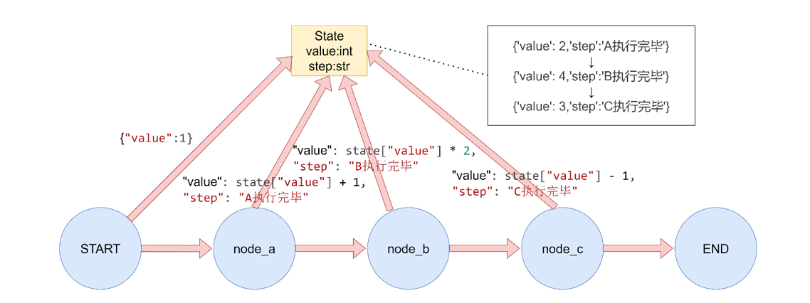
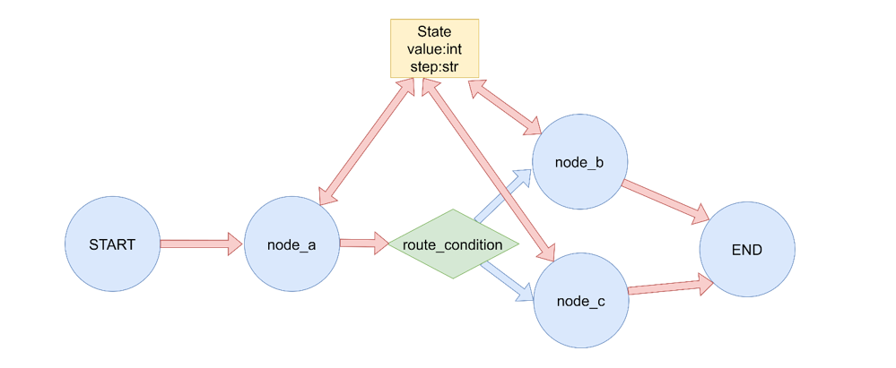
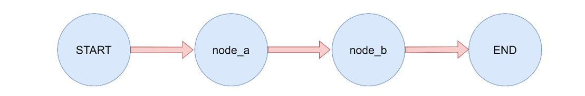
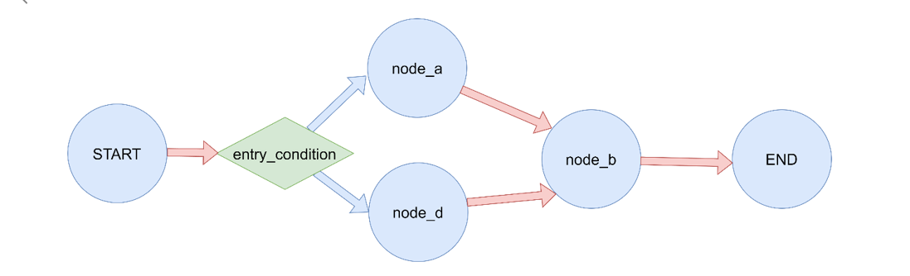
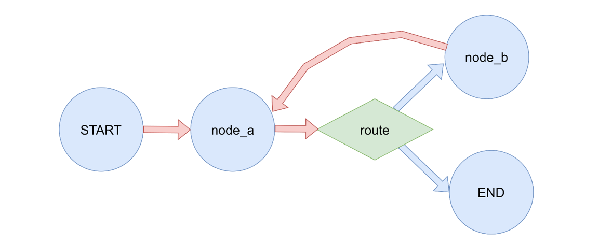

> 读前提示（LangGraph / LangChain 应用视角）
>
> - **适合人群**：已了解 [Graph API 与 State](/posts/langgraph-02-graph-api)、[Reducer 与状态合并](/posts/langgraph-03-reducer)、[节点与并行语义](/posts/langgraph-04-nodes)，准备系统梳理 **边** 与 **路由** 的读者。
> - **前置知识**：**`StateGraph`**、**`add_node`**、**`invoke`**；理解 **`START` / `END`** 为特殊节点；对 **超步（superstep）** 有印象则更易读懂「多出路并行」。
> - **读完收获**：能正确使用 **`add_edge`** 与 **`add_conditional_edges`**；会配置 **普通入口** 与 **条件入口**；理解 **同一节点多条出边** 时的调度直觉；能为 **循环图** 设计 **终止条件**，并知道 **`recursion_limit`** 与 **`GraphRecursionError`** 的用途。

# 1 边在 LangGraph 中的作用

在 **LangGraph** 中，**边（Edge）**负责描述 **控制流**：从一个节点到下一个节点 **如何走**、**何时停**。它与 **节点** 里写的业务逻辑配合，共同决定 **智能体 / 工作流** 的执行路径。

边与入口的常见类型如下（后文逐段展开）。

| 类型 | 典型 API / 写法 | 含义（直觉） |
| --- | --- | --- |
| **普通边** | **`add_edge(src, dst)`** | 无条件从 **`src`** 走到 **`dst`**（**`dst`** 可为 **`END`**） |
| **条件边** | **`add_conditional_edges(src, route, path_map?)`** | 根据 **状态**（或路由函数返回值）选择 **一个或多个** 下游节点 |
| **入口** | **`add_edge(START, first_node)`** | 指定 **用户输入进入图后** 第一个执行的节点 |
| **条件入口** | **`add_conditional_edges(START, route, path_map)`** | **首次调度** 前就用函数决定从哪个节点开始 |

**LangGraph** 文档中的英文名称与上表对应关系：**Normal Edge**、**Conditional Edge**、**Entry Point**、**Conditional Entry Point**。

## 1.1 同一节点的多条出边与超步

若 **同一个节点** 上注册了 **多条出边**（例如 **静态扇出** 到多个下游），这些 **目标节点** 通常会在 **下一个超步（superstep）** 内被 **一并调度**，效果上接近 **并行执行**（与 [节点篇](/posts/langgraph-04-nodes) 中 **Send** 等 **动态扇出** 可对照理解）。实际合并顺序仍受 **State** 与 **Reducer** 约束。

---

# 2 普通边：`add_edge`

**普通边**表示 **固定跳转**：不根据运行时状态改道，只把 **有向边** 从 **源节点** 连到 **目标节点**。图 **开始** 与 **结束** 常写作 **`add_edge(START, ...)`** 与 **`add_edge(..., END)`**。



```python
"""
LangGraph 普通边演示

普通边是直接连接两个节点的边，表示无条件地从一个节点跳转到另一个节点。
"""

from typing_extensions import TypedDict
from langgraph.graph import StateGraph, START, END

# 定义状态
class GraphState(TypedDict):
    value: int
    step: str

# 定义节点函数
def node_a(state: GraphState) -> dict:
    """节点 A"""
    print("执行节点 A")
    return {"value": state["value"] + 1, "step": "A 执行完毕"}

def node_b(state: GraphState) -> dict:
    """节点 B"""
    print("执行节点 B")
    return {"value": state["value"] * 2, "step": "B 执行完毕"}

def node_c(state: GraphState) -> dict:
    """节点 C"""
    print("执行节点 C")
    return {"value": state["value"] - 1, "step": "C 执行完毕"}

def main():
    """演示普通边"""
    print("=== 普通边演示 ===")

    # 创建图
    builder = StateGraph(GraphState)

    # 添加节点
    builder.add_node("node_a", node_a)
    builder.add_node("node_b", node_b)
    builder.add_node("node_c", node_c)

    # 添加普通边
    builder.add_edge(START, "node_a")  # 从开始到 A
    builder.add_edge("node_a", "node_b")  # 从 A 到 B
    builder.add_edge("node_b", "node_c")  # 从 B 到 C
    builder.add_edge("node_c", END)  # 从 C 到结束

    # 编译图
    graph = builder.compile()

    # 执行图
    result = graph.invoke({"value": 1})
    print(f"执行结果: {result}\n")

if __name__ == "__main__":
    main()
```

---

# 3 条件边：`add_conditional_edges`

**条件边**在 **源节点执行完毕之后** 调用 **路由函数**；函数的返回值（经 **`path_map`** 映射或直接作为节点名，取决于写法）决定 **下一步进入哪些节点。**

- 若提供 **`path_map`**：返回值作为 **键**，查到 **真实节点名**（适合返回值用 **枚举别名**、节点名较长等情况）。
- 若省略 **`path_map`**（部分版本 / 用法）：返回值应直接是 **下一节点名称** 或 **`END`**（以当前 **LangGraph** 版本文档为准）。



```python
"""
LangGraph 条件边演示

条件边根据当前状态动态决定下一个要执行的节点。
"""

from typing import Literal
from typing_extensions import TypedDict
from langgraph.graph import StateGraph, START, END

# 定义状态
class GraphState(TypedDict):
    value: int
    step: str

# 定义节点函数
def node_a(state: GraphState) -> dict:
    """节点 A"""
    print("执行节点 A")
    return {"value": state["value"] + 1, "step": "A 执行完毕"}

def node_b(state: GraphState) -> dict:
    """节点 B"""
    print("执行节点 B")
    return {"value": state["value"] * 2, "step": "B 执行完毕"}

def node_c(state: GraphState) -> dict:
    """节点 C"""
    print("执行节点 C")
    return {"value": state["value"] - 1, "step": "C 执行完毕"}

# 条件边的路由函数（返回值需与 path_map 的键一致）
def route_condition(state: GraphState) -> Literal["node_b_alias", "node_c_alias"]:
    """根据 value 决定路由到哪个节点"""
    if state["value"] % 2 == 0:
        return "node_b_alias"  # 偶数路由到节点 B
    else:
        return "node_c_alias"  # 奇数路由到节点 C

def main():
    """演示条件边"""
    print("=== 条件边演示 ===")

    # 创建图
    builder = StateGraph(GraphState)

    # 添加节点
    builder.add_node("node_a", node_a)
    builder.add_node("node_b", node_b)
    builder.add_node("node_c", node_c)

    # 添加边
    builder.add_edge(START, "node_a")  # 入口

    # 添加条件边
    builder.add_conditional_edges(
        "node_a",  # 源节点
        route_condition,  # 路由函数
        {  # 路由映射：别名 -> 实际节点名
            "node_b_alias": "node_b",
            "node_c_alias": "node_c",
        },
    )

    # 从 B 和 C 到结束
    builder.add_edge("node_b", END)
    builder.add_edge("node_c", END)

    # 编译图
    graph = builder.compile()

    # 执行图 - 偶数情况
    print("输入值为偶数:")
    result = graph.invoke({"value": 2})
    print(f"执行结果: {result}")

    # 执行图 - 奇数情况
    print("\n输入值为奇数:")
    result = graph.invoke({"value": 1})
    print(f"执行结果: {result}\n")

if __name__ == "__main__":
    main()

```

---

# 4 入口点：`START` 与普通边

**入口点**解决的是：**第一次** 从图外进入时，先跑哪个节点。最常见写法是 **`add_edge(START, "your_first_node")`**，与 **普通边** 一致，只是 **源** 固定为 **`START`**。



```python
"""
LangGraph 入口点演示

入口点定义了图开始执行的第一个节点。
"""

from typing_extensions import TypedDict
from langgraph.graph import StateGraph, START, END

# 定义状态
class GraphState(TypedDict):
    value: int
    step: str

# 定义节点函数
def node_a(state: GraphState) -> dict:
    """节点 A"""
    print("执行节点 A")
    return {"value": state["value"] + 1, "step": "A 执行完毕"}

def node_b(state: GraphState) -> dict:
    """节点 B"""
    print("执行节点 B")
    return {"value": state["value"] * 2, "step": "B 执行完毕"}

def main():
    """演示入口点"""
    print("=== 入口点演示 ===")

    # 创建图
    builder = StateGraph(GraphState)

    # 添加节点
    builder.add_node("node_a", node_a)
    builder.add_node("node_b", node_b)

    # 设置入口和出口
    builder.add_edge(START, "node_a")
    builder.add_edge("node_a", "node_b")
    builder.add_edge("node_b", END)

    # 编译图
    graph = builder.compile()

    # 执行图
    result = graph.invoke({"value": 0})
    print(f"执行结果: {result}\n")

if __name__ == "__main__":
    main()

```

---

# 5 条件入口点：从 `START` 分支

**条件入口**把 **「第一步走哪」** 也交给 **路由函数**：对 **`START`** 使用 **`add_conditional_edges`**，在 **首次调度** 时根据 **输入状态** 选择 **node_a**、**node_d** 等不同起点，再汇合到后续公共节点（本例中 **`node_b`**）。



```python
"""
LangGraph 条件入口点演示

条件入口点允许根据输入状态动态决定从哪个节点开始执行。
"""

from typing import Literal
from typing_extensions import TypedDict
from langgraph.graph import StateGraph, START, END

# 定义状态
class GraphState(TypedDict):
    value: int
    step: str

# 定义节点函数
def node_a(state: GraphState) -> dict:
    """节点 A"""
    print("执行节点 A")
    return {"value": state["value"] + 1, "step": "A 执行完毕"}

def node_b(state: GraphState) -> dict:
    """节点 B"""
    print("执行节点 B")
    return {"value": state["value"] * 2, "step": "B 执行完毕"}

def node_d(state: GraphState) -> dict:
    """节点 D"""
    print("执行节点 D")
    return {"value": state["value"] + 10, "step": "D 执行完毕"}

# 条件入口点的路由函数
def entry_condition(state: GraphState) -> Literal["node_a", "node_d"]:
    """根据输入值决定从哪个节点开始"""
    if state.get("value", 0) > 5:
        return "node_d"  # 大于 5 从节点 D 开始
    else:
        return "node_a"  # 否则从节点 A 开始

def main():
    """演示条件入口点"""
    print("=== 条件入口点演示 ===")

    # 创建图
    builder = StateGraph(GraphState)

    # 添加节点
    builder.add_node("node_a", node_a)
    builder.add_node("node_d", node_d)
    builder.add_node("node_b", node_b)

    # 添加条件入口点
    builder.add_conditional_edges(
        START,  # 起始点
        entry_condition,  # 路由函数
        {  # 路由映射
            "node_a": "node_a",
            "node_d": "node_d",
        },
    )

    # 添加普通边
    builder.add_edge("node_a", "node_b")
    builder.add_edge("node_d", "node_b")
    builder.add_edge("node_b", END)

    # 编译图
    graph = builder.compile()

    # 执行图 - 小于等于 5 的情况
    print("输入值小于等于 5:")
    result = graph.invoke({"value": 3})
    print(f"执行结果: {result}")

    # 执行图 - 大于 5 的情况
    print("\n输入值大于 5:")
    result = graph.invoke({"value": 10})
    print(f"执行结果: {result}\n")

if __name__ == "__main__":
    main()

```

---

# 6 循环、终止条件与 `recursion_limit`

带 **环（循环）** 的图必须明确 **何时结束**，否则理论上会 **无限执行**。常见做法是：在 **条件边** 上判断 **状态**（如计数、标志位、LLM 结构化输出等），满足 **终止条件** 时路由到 **`END`**。

此外，**`recursion_limit`**（默认约为 **25** 个 **超步**，具体以版本文档为准）是 **安全网**：即使逻辑漏写终止条件，也会在超过上限时抛出 **`GraphRecursionError`**，便于 **发现死循环** 或 **过长运行**。

> **构图提示**：典型环模式可记为 **`a` → 条件边 →（继续则）`b` → `a`**，直到条件满足走到 **`END`**。务必区分 **「路由回 `a`」** 与 **「误把无条件边连成死环」**。



```python
from typing import Literal
from typing_extensions import TypedDict
from langgraph.graph import StateGraph, START, END
from langgraph.errors import GraphRecursionError

class LoopState(TypedDict):
    count: int
    result: str
    max_count: int

def node_a(state: LoopState) -> dict:
    """节点 a：处理逻辑并更新计数"""
    print(f"执行节点 a，当前计数: {state['count']}")
    return {
        "count": state["count"] + 1,
        "result": f"已处理 {state['count']} 次",
    }

def node_b(state: LoopState) -> dict:
    """节点 b：辅助处理"""
    print(f"执行节点 b，当前计数: {state['count']}")
    return {
        "result": f"已处理 {state['count']} 次 - 辅助处理",
    }

def route(state: LoopState) -> Literal["b", "__end__"]:
    """条件路由：继续循环或终止（END 在运行时常对应 __end__）"""
    if state["count"] >= state["max_count"]:
        print(f"满足终止条件，计数 {state['count']} >= {state['max_count']}，结束")
        return END
    else:
        print(f"未满足终止条件，计数 {state['count']} < {state['max_count']}，回到 b")
        return "b"

# 创建图
builder = StateGraph(LoopState)

# 添加节点
builder.add_node("a", node_a)
builder.add_node("b", node_b)

# 添加边
builder.add_edge(START, "a")
builder.add_conditional_edges("a", route)
builder.add_edge("b", "a")

# 编译图
graph = builder.compile()

# 执行图
print("=== 开始执行工作流 ===")
try:
    result = graph.invoke(
        input={
            "count": 0,
            "result": "",
            "max_count": 3,
        },
        config={
            "recursion_limit": 6,  # 超级步上限（按需求调大/调小）
        },
    )
    print("=== 执行结果 ===")
    print(result)
except GraphRecursionError as e:
    print(f"递归错误: {e}")
```

**小结**：

- **业务终止** 应主要靠 **状态 + 条件边 → `END`** 表达清楚。
- **`recursion_limit`** 用于 **兜底** 与 **调试**；若频繁触发 **`GraphRecursionError`**，优先检查 **路由条件** 与 **环上每条边** 是否与设计一致。
