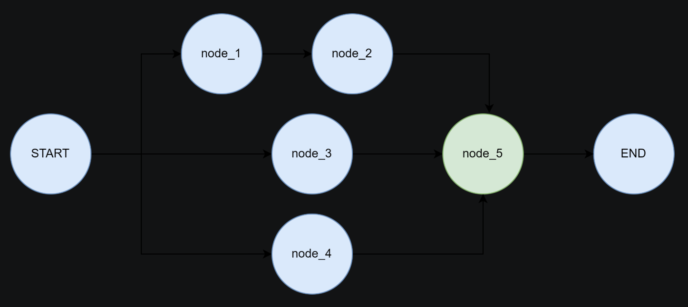

> 读前提示（LangGraph / LangChain 应用视角）
>
> - **适合人群**：已了解 [Graph API 与 State](/posts/langgraph-02-graph-api)、[Reducer](/posts/langgraph-03-reducer)、[节点](/posts/langgraph-04-nodes)、[边](/posts/langgraph-05-edges)，希望用 **短代码** 巩固直觉的读者。
> - **前置知识**：**`StateGraph`**、**`add_node` / `add_edge`**、**`invoke`**；**`START` / `END`**；题二需对 **超步（superstep）** 与 **`defer=True`** 有印象（见节点篇）。
> - **读完收获**：能独立搭一条 **START → 计算 → 输出 → END** 的线性图；会用 **`defer=True`** 让 **多前驱节点** 在合适时机 **只汇聚执行一次**，并从打印时间戳 **看出延迟效果**。
> - **说明**：底层仍是 **合并后的全局 `State`**；文中「按字段传递」指 **各节点只读写的键不同**、用 **返回值做部分更新**，而不是进程间私有内存。

# 1 练习概览

| 题目 | 侧重 | 关键 API / 概念 |
| --- | --- | --- |
| **题一** | 线性图、状态键分工 | **`TypedDict`**、**`add_edge(START, …)`**、部分状态返回 |
| **题二** | 并行扇出、多入边、延迟汇聚 | **`START`** 多出路、**`defer=True`**、控制台时序 |

下文题目要求用 **列表** 列出，代码块内保留注释便于对照。

# 2 题一：线性图与「按字段」的状态更新

## 2.1 题目要求

- 参考下图拓扑，**自行设计** **`WorkflowState`（`TypedDict`）** 的字段。
- **`calc`** 节点：对 **工作流输入的 `int`** 做 **二次幂**，把结果交给下游。
- **`output`** 节点：负责 **在控制台展示** 最终计算结果。
- 用 **「各阶段只关心部分键」** 的方式组织数据流（见上文读前提示：**并非**真正的私有内存，而是 **键级别** 的职责划分）。
- 拓扑示意：


## 2.2 参考实现

下列写法与系列前文一致：用 **`add_edge(START, "calc")`** 作为入口（与 **`set_entry_point`** 二选一即可，此处统一为 **`START`**）。

```python
# 参考代码

from typing import TypedDict
from langgraph.graph import StateGraph, START, END
from langgraph.checkpoint.memory import MemorySaver

# --------------------------
# 1. 定义状态结构（按字段分工）
# --------------------------
class WorkflowState(TypedDict):
    """input_num：来自调用方；squared_result：由 calc 写入，供 output 读取。"""
    input_num: int | None
    squared_result: int | None


# --------------------------
# 2. 节点函数
# --------------------------
def calc_node(state: WorkflowState) -> WorkflowState:
    """读取 input_num，写入 squared_result。"""
    input_val = state["input_num"]
    if input_val is None:
        raise ValueError("calc 节点未接收到有效的 int 型输入数据")

    squared = input_val ** 2
    print(f"[calc] 输入: {input_val}, 二次幂: {squared}")

    # 返回字典会与已有 State 合并（部分更新）
    return {"squared_result": squared, "input_num": input_val}


def output_node(state: WorkflowState) -> WorkflowState:
    """只依赖 squared_result 做展示。"""
    result = state["squared_result"]
    if result is None:
        raise ValueError("output 节点未接收到有效的计算结果")

    print(f"[output] 最终结果: {result}")
    return state


# --------------------------
# 3. 构建 LangGraph
# --------------------------
workflow = StateGraph(WorkflowState)
workflow.add_node("calc", calc_node)
workflow.add_node("output", output_node)

workflow.add_edge(START, "calc")
workflow.add_edge("calc", "output")
workflow.add_edge("output", END)

memory = MemorySaver()
app = workflow.compile(checkpointer=memory)

# --------------------------
# 4. 测试运行
# --------------------------
if __name__ == "__main__":
    test_input = 5
    print(f"[启动] 初始输入: {test_input}")

    initial_state: WorkflowState = {"input_num": test_input, "squared_result": None}

    result = app.invoke(
        initial_state,
        config={"configurable": {"thread_id": "square_calc_workflow_001"}},
    )

    print("\n[结束] 最终状态:", result)
```

## 2.3 小结

- **`calc` → `output`** 的数据契约体现在 **`squared_result`** 上；**`input_num`** 是否回传可按 Reducer/合并规则取舍（此处显式带回仅为清晰）。
- 若去掉 **检查点**，可改为 **`workflow.compile()`** 无 **`checkpointer`**，逻辑不变。

# 3 题二：并行分支与 `defer=True` 汇聚

## 3.1 题目要求

- 拓扑与示意图一致（见下图）：仅对 **拥有多个前序节点** 的节点开启 **`defer=True`**（单前驱节点不必开 **`defer`**）。
- **自主设计** 控制台输出，使读者能 **从时间戳** 看出：**汇聚节点** 在 **各并行分支就绪后** 才执行。
- 下图来自本地资源：



## 3.2 行为直觉（对照节点篇）

- **`START`** 连到 **多个** 节点时，这些节点通常在 **同一超步** 内被调度（**静态扇出**）。
- **`node2`** 只有 **`node1` 一个前驱**，按题意 **不需要** **`defer=True`**；**`defer`** 留给真正的 **多入边汇聚点**。
- **`node5`** 有 **三条入边**（**`node2` / `node3` / `node4`**），必须 **`defer=True`**，才能在 **三条分支都结束** 后再 **执行一次**，时间戳上最容易看出 **延迟汇聚**。

## 3.3 参考实现

```python
import time
from typing import TypedDict
from langgraph.graph import StateGraph, START, END


class State(TypedDict):
    pass


def node1(state: State) -> dict:
    print(f"→ node1 开始 {time.strftime('%H:%M:%S')}")
    time.sleep(1)
    return {}


def node2(state: State) -> dict:
    print(f"→ node2 开始 {time.strftime('%H:%M:%S')}")
    time.sleep(1)
    return {}


def node3(state: State) -> dict:
    print(f"→ node3 开始 {time.strftime('%H:%M:%S')}")
    time.sleep(2)
    return {}


def node4(state: State) -> dict:
    print(f"→ node4 开始 {time.strftime('%H:%M:%S')}")
    time.sleep(1.5)
    return {}


def node5(state: State) -> dict:
    print(f"\n✓ node5（defer）上游就绪，执行 {time.strftime('%H:%M:%S')}")
    return {}


builder = StateGraph(State)

builder.add_node("node1", node1)
builder.add_node("node2", node2)  # 单前驱，无需 defer
builder.add_node("node3", node3)
builder.add_node("node4", node4)
# 多前驱汇聚：必须 defer，避免分支未齐就执行
builder.add_node("node5", node5, defer=True)

builder.add_edge(START, "node1")
builder.add_edge(START, "node3")
builder.add_edge(START, "node4")
builder.add_edge("node1", "node2")
builder.add_edge("node2", "node5")
builder.add_edge("node3", "node5")
builder.add_edge("node4", "node5")
builder.add_edge("node5", END)

app = builder.compile()

if __name__ == "__main__":
    print("工作流启动（观察各节点时间戳与 node5 是否最后汇聚）\n")
    app.invoke({})
    print("\n全部完成")
```

运行时可对照：**`node3` / `node4`** 的 **`sleep`** 较长，**`node5`** 的打印应出现在 **三者都结束之后**。

# 4 题三（扩展）

可自行追加一题，例如：

- 在 **题二** 拓扑上为某一节点配置 **`RetryPolicy`** 或 **`CachePolicy`**（见节点篇），观察 **重试日志** 或 **缓存命中**；
- 或为 **`node5`** 增加 **条件出边**（**`add_conditional_edges`**，见边篇），练习 **汇聚后再分支**。

（若你补充题目描述与配图，可将本节替换为正式「题三」正文。）
