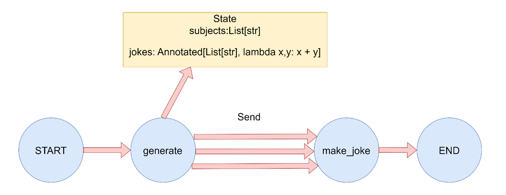

> 读前提示（LangGraph / LangChain 应用视角）
>
> - **适合人群**：已了解 [Graph API 与 State](/posts/langgraph-02-graph-api)、[Reducer](/posts/langgraph-03-reducer)、[节点与 Send 并行概要](/posts/langgraph-04-nodes)，希望把 **`Send`** 从「听说过」落到 **可运行代码** 的读者。
> - **前置知识**：**`StateGraph`**、**`add_conditional_edges`**、**`Annotated[..., operator.add]`**；理解 **条件边路由函数** 可以返回 **下一跳节点名** 或 **`Send` 列表**。
> - **读完收获**：能写出 **`return [Send("worker", {...}), ...]`** 的 **Map 阶段**；知道 **子任务状态** 如何与 **全局 State** 合并；会用 **Reducer** 把并行 **`jokes`** 等字段 **顺序归并**；能对照 [节点篇 §5](/posts/langgraph-04-nodes#5-并行分发send-与-reducer-合并顺序) 的 **`Send` vs 静态扇出** 表。

# 1 `Send` 在 LangGraph 中的作用

**`Send`** 是 **LangGraph** 里实现 **动态并行（Map-Reduce 式扇出 / 扇入）** 的核心原语：在 **运行时** 根据 **当前状态** 生成 **若干条** 指向同一目标节点（或不同节点）的 **并行调用**，每条调用可携带 **不同的局部状态片段**。

| 对比 | **静态扇出**（多条 **`add_edge`**） | **`Send` 动态扇出** |
| --- | --- | --- |
| **边数量** | 编译期固定 | **运行期**由列表长度决定 |
| **典型 API** | **`add_edge(A, B)`** 多次 | 路由函数 **`return [Send("B", s1), Send("B", s2), ...]`** |
| **入参** | 各分支常共享同一段 **State** | 每个 **`Send`** 可传 **不同 `dict`**，再与全局合并 |

本质：**`Send`** 是 **类**（不是普通函数），在 **条件边 / 入口路由** 的返回值里使用，由引擎展开为 **多条并行调度**。

# 2 核心概念与工作流程

## 2.1 它解决什么问题

在传统 **StateGraph** 里，**节点与静态边** 多在 **编译图** 时固定；而下面这类需求需要 **「条数随输入变化」** 的并行：

- **Map**：一个节点产出 **动态长度** 的列表（文档列表、查询词列表等）。
- **并行处理**：对 **每一项** 启动 **一次** 下游节点逻辑。
- **Reduce**：把各次返回值按 **Reducer** 合并回 **全局 State**（如列表拼接）。

为此，**LangGraph** 允许 **路由函数** 返回 **`Send` 对象列表**；引擎为 **每个 `Send`** 调度一次目标节点。

## 2.2 构造函数形式

```python
Send(target_node: str, arg: dict)
```

- **`target_node`**：目标节点在图中的 **注册名**（字符串）。
- **`arg`**：传入该次调用的 **状态片段**（会与当前 **全局 State** 按规则合并，具体以版本文档为准）；**每个 `Send`** 对应 **独立** 的一次节点运行上下文。

## 2.3 执行与合并（直觉）

- 在 **条件边（或 `START` 上的条件路由）** 的函数里，根据 **全局状态** 生成 **`List[Send]`**。
- 引擎对列表中 **每个 `Send`** **并行** 调用对应节点（**完成先后不保证**，与 [节点篇](/posts/langgraph-04-nodes) 一致）。
- 各节点返回的 **部分状态更新** 中，需要 **并行合并** 的字段应在 **`TypedDict`** 里用 **`Annotated[..., operator.add]`**（或其它 **Reducer**）声明，否则易冲突或覆盖。

# 3 示例：按主题列表并行生成内容

下图对应后文代码拓扑：



```python
"""
LangGraph：用 Send 实现 Map-Reduce 式并行。

第一个节点生成主题列表；条件边为每个主题返回 Send("make_joke", {...})；
make_joke 并行执行多次，jokes 通过 Reducer 合并为列表。
"""

import operator
from typing import Annotated, List, NotRequired, Sequence
from typing_extensions import TypedDict
from langgraph.graph import StateGraph, START, END
from langgraph.types import Send


class OverallState(TypedDict):
    """subjects：批处理输入；jokes：并行写入，用 operator.add 做列表拼接。"""
    subjects: List[str]
    jokes: Annotated[List[str], operator.add]
    # 单次 make_joke 由 Send 注入，可与全局键并存（见各版本合并规则）
    subject: NotRequired[str]


def generate_subjects(state: OverallState) -> dict:
    print("执行节点: generate_subjects")
    subjects = ["猫", "狗", "程序员"]
    print(f"生成主题列表: {subjects}")
    return {"subjects": subjects}


def make_joke(state: OverallState) -> dict:
    """每个 Send 传入 subject；只返回本分支贡献的 jokes 片段。"""
    subject = state.get("subject", "未知")
    print(f"执行节点: make_joke，处理主题: {subject}")

    jokes_map = {
        "猫": "为什么猫不喜欢在线购物？因为它们更喜欢实体店！",
        "狗": "为什么狗不喜欢计算机？因为它们害怕被鼠标咬！",
        "程序员": "为什么程序员喜欢洗衣服？因为他们在寻找 bugs！",
        "未知": "这是一个关于未知主题的神秘笑话。",
    }
    joke = jokes_map.get(subject, f"这是一个关于 {subject} 的即兴笑话。")
    print(f"生成笑话: {joke}")
    return {"jokes": [joke]}


def map_subjects_to_jokes(state: OverallState) -> Sequence[Send]:
    """为每个主题构造一个 Send，实现动态并行。"""
    print("执行条件边函数: map_subjects_to_jokes")
    subjects = state["subjects"]
    print(f"映射主题到 joke 任务: {subjects}")
    send_list = [Send("make_joke", {"subject": s}) for s in subjects]
    print(f"生成 Send 列表（共 {len(send_list)} 个）")
    return send_list


def main() -> None:
    print("=== Map-Reduce 模式演示 ===\n")

    builder = StateGraph(OverallState)
    builder.add_node("generate_subjects", generate_subjects)
    builder.add_node("make_joke", make_joke)

    builder.add_edge(START, "generate_subjects")
    builder.add_conditional_edges("generate_subjects", map_subjects_to_jokes)
    builder.add_edge("make_joke", END)

    graph = builder.compile()

    initial_state: OverallState = {"subjects": [], "jokes": []}
    print("初始状态:", initial_state)
    print("\n开始执行图...")

    result = graph.invoke(initial_state)
    print(f"\n最终结果: {result}")
    print("\n=== 演示完成 ===")


if __name__ == "__main__":
    main()
```

**运行输出示例**（**`make_joke` 三次执行顺序可能变化**，列表合并顺序通常与 **`Send` 生成顺序** 相关，见节点篇说明）：

```text
映射主题到 joke 任务: ['猫', '狗', '程序员']
生成 Send 列表（共 3 个）
执行节点: make_joke，处理主题: 猫
...
执行节点: make_joke，处理主题: 狗
...
执行节点: make_joke，处理主题: 程序员
...

最终结果: {'subjects': ['猫', '狗', '程序员'], 'jokes': [...]}
```

从输出可以对照理解：

1. **`generate_subjects`** 先运行，写入 **`subjects`**。
2. **`map_subjects_to_jokes`** 为 **每个主题** 创建一个 **`Send("make_joke", {"subject": ...})`**。
3. **`make_joke`** 被 **并行调度多次**（每次一个 **`subject`**）。
4. 各次返回的 **`{"jokes": [一句]}`** 经 **`operator.add`** **拼接** 为完整 **`jokes` 列表**。

**适用场景举例**：

- 批量用户请求、多文档并行摘要；
- 多关键词并行检索；
- 运行时才能确定 **任务个数** 的批处理。

# 4 关键特性与注意事项

- **并行性**：**`Send` 列表**展开后为 **真并行**，**完成顺序一般不保证**；若业务必须 **严格顺序**，应改用 **链式边** 而非依赖并行完成次序。
- **局部入参**：每个 **`Send(..., arg)`** 的 **`arg`** 作为 **该次调用** 的状态片段；与 **静态扇出**「各分支读同一份 State」的对比见上文表格。
- **合并字段**：并行写入同一键时，必须在 **Schema** 里配置 **Reducer**（如 **`Annotated[list, operator.add]`**），否则会 **覆盖** 或 **不符合预期**。
- **返回位置**：**`Send` 列表** 由 **路由函数** 返回（**`add_conditional_edges`** 或 **`START` 的条件路由** 等）；**不要**在普通节点函数里误以为「手动调 `Send`」会调度图——**调度由引擎根据路由返回值完成**。
- **语义**：**`Send` 本身** 不是节点返回值类型；**业务结果** 仍通过节点 **`return {状态更新}`** 进入 **Reducer**。

# 5 常见应用场景

- **批量数据处理**：多文件、多段落并行解析 / 摘要。
- **并行搜索**：多查询词、多索引分片同时检索再合并。
- **动态任务队列**：根据上一轮 LLM 或规则输出，决定 **下一波** 子任务数量与参数。

---

若你使用的 **LangGraph 版本** 对 **`Send` 与 State 合并** 有额外字段要求，请以 **官方文档** 为准，并把 **`OverallState`** 中 **`NotRequired`** 字段与 **Reducer** 对齐即可。
