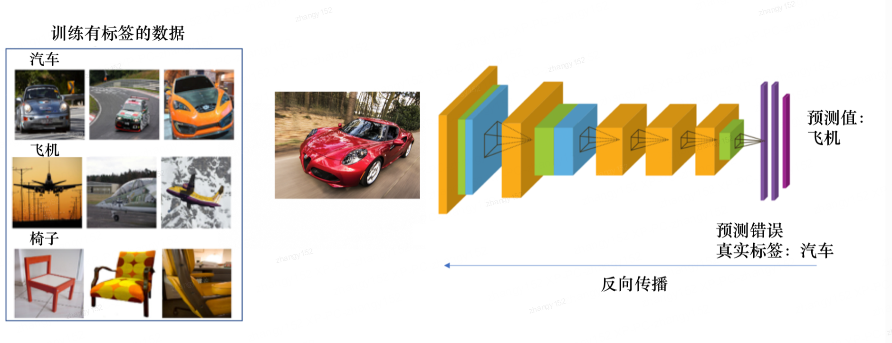
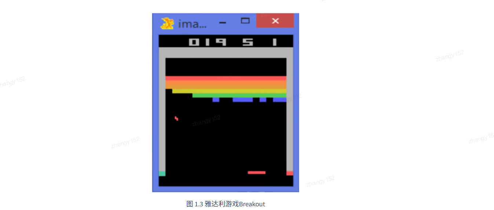
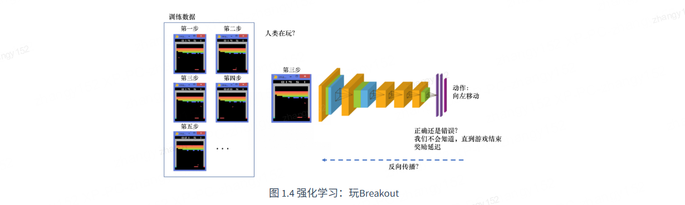

# 强化学习

## 1.1 强化学习概述

**强化学习（reinforcement learning，RL）** 讨论的问题是智能体（agent）怎么在复杂、不确定的环境（environment）中最大化它能获得的奖励。如图 1.1 所示，强化学习由两部分组成：智能体和环境。在强化学习过程中，智能体与环境一直在交互。智能体在环境中获取某个状态后，它会利用该状态输出一个动作 （action），这个动作也称为决策（decision）。然后这个动作会在环境中被执行，环境会根据智能体采取的动作，输出下一个状态以及当前这个动作带来的奖励。智能体的目的就是尽可能多地从环境中获取奖励。

### 1.1.1 强化学习与监督学习

我们可以把强化学习与监督学习做一个对比。以图片分类为例，如图 1.2 所示， **监督学习（supervised learning）** 假设我们有大量被标注的数据，比如汽车、飞机、椅子这些被标注的图片，这些图片都要**满足独立同分布**，即它们之间是没有关联关系的。假设我们训练一个分类器，比如神经网络。为了分辨输入的 图片中是汽车还是飞机，在训练过程中，需要把正确的标签信息传递给神经网络。 当神经网络做出错误的预测时，比如输入汽车的图片，它预测出来是飞机，我们就会直接告诉它，该预测是错误的，正确的标签应该是汽车。最后我们根据类似错误写出一个损失函数（loss function），通过反向传播（back propagation）来训练神经网络。

在强化学习中，监督学习的两个假设其实都不能得到满足。以雅达利（Atari） 游戏 Breakout 为例，如图 1.3 所示，这是一个打砖块的游戏，控制木板左右移动从而把球反弹到上面来消除砖块。在玩游戏的过程中，我们可以发现智能体得到的观测（observation）不是独立同分布的，上一帧与下一帧间其实有非常强的连续性。我们得到的数据是相关的时间序列数据，不满足独立同分布。另外，我们并没有立刻获得反馈，游戏没有告诉我们哪个动作是正确动作。比如现在把木板往右移，这只会使得球往上或者往左一点儿，我们并不会得到即时的反馈。因此，强化学习之所以困难，是因为智能体不能得到即时的反馈，然而我们依然希望智能体在这个环境中学习。

如图 1.4 所示，强化学习的训练数据就是一个玩游戏的过程。我们从第 1 步开始，采取一个动作，比如我们把木板往右移，接到球。第 2 步我们又做出动作，得到的训练数据是一个玩游戏的序列。比如现在是在第 3 步，我们把这个序列放进网络，希望网络可以输出一个动作，即在当前的状态应该输出往右移或 者往左移。这里有个问题，我们没有标签来说明现在这个动作是正确还是错误的，必须等到游戏结束才可能知道，这个游戏可能 10s 后才结束。现在这个动作到底对最后游戏是否能赢有无帮助，我们其实是不清楚的。这里我们就面临 **延迟奖励（delayed reward）** 的问题，延迟奖励使得训练网络非常困难。

强化学习和监督学习的区别如下。

（1）强化学习输入的样本是序列数据，而不像监督学习里面样本都是独立的。

（2）学习器不知道每一步正确的动作，学习器需要自己去发现哪些动作可以带来最多的奖励，只能通过不停地尝试来发现最有利的动作。

（3）智能体获得自己能力的过程，其实是不断地试错探索（trial-and-error exploration）的过程。探索 （exploration）和利用（exploitation）是强化学习里面非常核心的问题。其中，探索指尝试一些新的动作， 这些新的动作有可能会使我们得到更多的奖励，也有可能使我们“一无所有”；利用指采取已知的可以获得最多奖励的动作，重复执行这个动作，因为我们知道这样做可以获得一定的奖励。因此，我们需要在探索和利用之间进行权衡，这也是在监督学习里面没有的情况。

（4）在强化学习过程中，没有非常强的监督者（supervisor），只有 **奖励信号（reward signal** ），并且奖励信号是延迟的，即环境会在很久以后告诉我们之前我们采取的动作到底是不是有效的。因为我们没有得 到即时反馈，所以智能体使用强化学习来学习就非常困难。当我们采取一个动作后，如果我们使用监督学习，我们就可以立刻获得一个指导，比如，我们现在采取了一个错误的动作，正确的动作应该是什么。而在强化学习里面，环境可能会告诉我们这个动作是错误的，但是它并没有告诉我们正确的动作是什么。而且更困难的是，它可能是在一两分钟过后告诉我们这个动作是错误的。所以这也是强化学习和监督学习不同的地方。

通过与监督学习的比较，我们可以总结出强化学习的一些特征。

（1）强化学习会试错探索，它通过探索环境来获取对环境的理解。

（2）强化学习智能体会从环境里面获得延迟的奖励。

（3）在强化学习的训练过程中，时间非常重要。因为我们得到的是有时间关联的数据（sequential data）， 而不是独立同分布的数据。在机器学习中，如果观测数据有非常强的关联，会使得训练非常不稳定。这也是为什么在监督学习中，我们希望数据尽量满足独立同分布，这样就可以消除数据之间的相关性。

（4）智能体的动作会影响它随后得到的数据，这一点是非常重要的。在训练智能体的过程中，很多时 候我们也是通过正在学习的智能体与环境交互来得到数据的。所以如果在训练过程中，智能体不能保持稳定，就会使我们采集到的数据非常糟糕。我们通过数据来训练智能体，如果数据有问题，整个训练过程就会失败。所以在强化学习里面一个非常重要的问题就是，怎么让智能体的动作一直稳定地提升。

### 1.1.2 强化学习的例子

为什么我们关注强化学习，其中非常重要的一个原因就是强化学习得到的模型可以有超人类的表现。 监督学习获取的监督数据，其实是人来标注的，比如 ImageNet 的图片的标签都是人类标注的。因此我们 可以确定监督学习算法的上限（upper bound）就是人类的表现，标注结果决定了它的表现永远不可能超越人类。但是对于强化学习，它在环境里面自己探索，有非常大的潜力，它可以获得超越人类的能力的表现，比如 DeepMind 的 AlphaGo 这样一个强化学习的算法可以把人类顶尖的棋手打败。

这里给大家举一些在现实生活中强化学习的例子。

（1）在自然界中，羚羊其实也在做强化学习。它刚刚出生的时候，可能都不知道怎么站立，然后它通过试错，一段时间后就可以跑得很快，可以适应环境。

（2）我们也可以把股票交易看成强化学习的过程。我们可以不断地买卖股票，然后根据市场给出的反馈来学会怎么去买卖可以让我们的奖励最大化。

（3）玩雅达利游戏或者其他电脑游戏，也是一个强化学习的过程，我们可以通过不断试错来知道怎么 玩才可以通关。

图 1.5 所示为强化学习的一个经典例子，即雅达利的 Pong 游戏。游戏中右边的选手把球拍到左边， 然后左边的选手需要把球拍到右边。训练好的强化学习智能体和正常的选手有区别：强化学习的智能体会一直做无意义的振动，而正常的选手不会做出这样的动作。

>  [datawhalechina.github.io/easy-rl/#/chapter1/chapter1](https://datawhalechina.github.io/easy-rl/#/chapter1/chapter1)
