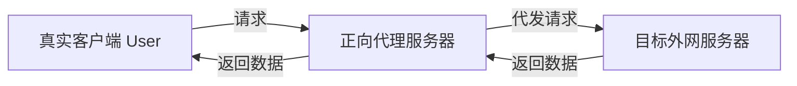
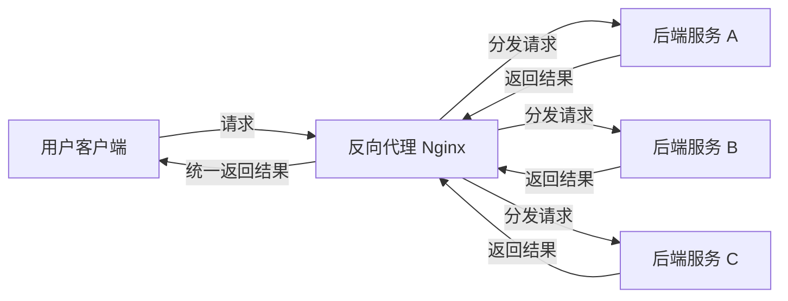
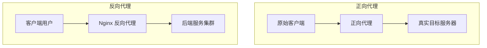
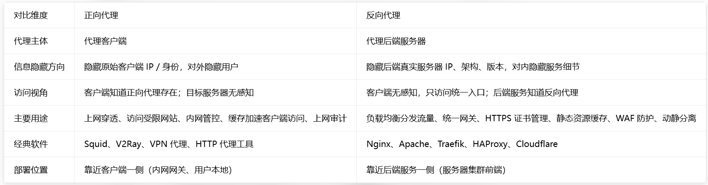

# Nginx 简介

## 一、背景介绍

Nginx 是一款高性能的 HTTP Web 服务器与反向代理服务器，同时也可作为 POP3/SMTP/IMAP 邮件代理服务器。

由俄罗斯开发者伊戈尔·赛索耶夫（Igor Sysoev）使用 C 语言开发，首个版本 0.1.0 于 2004 年 10 月 4 日正式发布。赛索耶夫随后将 Nginx 源代码开源，为其后续的蓬勃发展奠定了基础。

## 二、名词解释

### 2.1 Web 服务器

Web 服务器（Web Server）也叫网页服务器，主要功能是为用户提供网上信息浏览服务。

### 2.2 HTTP

HTTP（HyperText Transfer Protocol）是超文本传输协议，用于从 Web 服务器传输超文本到本地浏览器，是互联网上应用最广泛的协议之一。它遵循客户端／服务器的请求—应答模型：客户端（浏览器、爬虫等）向服务器指定端口发起请求，服务器返回响应。

### 2.3 POP3 / SMTP / IMAP（邮件协议）

- **POP3**（Post Office Protocol 3）：邮局协议第三版
- **SMTP**（Simple Mail Transfer Protocol）：简单邮件传输协议
- **IMAP**（Internet Mail Access Protocol）：交互式邮件存取协议

Nginx 也可以作为电子邮件代理服务器，充当上述协议的前端网关。

## 三、正向代理 vs 反向代理

### 3.1 正向代理

- **服务对象**：客户端（用户 / 浏览器）
- **位置**：客户端侧 / 客户端所在内网网关
- **角色**：替客户端访问真实服务器；真实服务器不知道最终原始客户端是谁
- **典型场景**：VPN、翻墙代理、公司内网上网代理、squid 代理
- **核心作用**：隐藏真实客户端、访问外网 / 受限资源、缓存、过滤访问、审计
- **一句话**：**代理客户端，服务器看不见真实用户**

> 目标服务器只知道正向代理的 IP，不知道原始 User 是谁。

### 3.2 反向代理

- **服务对象**：后端服务器集群
- **位置**：服务端侧，位于前端入口、后端服务器集群前面
- **角色**：替后端服务器集群接收用户请求；客户端不知道真实后端服务器是谁
- **典型场景**：Nginx、负载均衡、动静分离、HTTPS 统一证书、防攻击、限流
- **核心作用**：负载均衡、隐藏后端真实服务、统一入口、SSL 终止、缓存静态资源、防护后端
- **一句话**：**代理后端服务器，用户看不见真实后端节点**

> 用户只访问 Nginx，不知道后端真实服务节点。

### 3.3 对比

## 四、常见 Web 服务器对比

### 4.1 IIS

全称 Internet Information Services，是微软公司提供的基于 Windows 系统的互联网基本服务。Windows 作为服务器在稳定性和性能上都不如类 UNIX 操作系统，因此在需要高性能 Web 服务器的场合下，IIS 可能就会被 " 冷落 "。

### 4.2 Tomcat

Tomcat 是一个运行 Servlet 和 JSP 的 Web 应用软件，技术先进、性能稳定而且开放源代码，因此深受 Java 爱好者的喜爱并得到部分软件开发商的认可，成为目前较流行的 Web 应用服务器。但 Tomcat 天生是一个重量级的 Web 服务器，对静态文件和高并发的处理比较弱。

### 4.3 Apache

Apache 发展时期很长，大概在 2014 年以前都是市场份额第一的服务器。它有诸多优点：稳定、开源、跨平台。但出现时间太久，在它兴起的年代，互联网产业规模远不如今天，所以它被设计成一个重量级的、不支持高并发的 Web 服务器。

在 Apache 服务器上，若有数以万计的并发 HTTP 请求同时访问，会导致服务器消耗大量内存，操作系统内核对成百上千的 Apache 进程做上下文切换也会消耗大量 CPU 资源，进而导致 HTTP 请求的平均响应速度降低——这些都决定了 Apache 不可能成为高性能的 Web 服务器。这也促使了 Lighttpd 和 Nginx 的出现。

### 4.4 Lighttpd

Lighttpd 是德国的一个开源 Web 服务器软件，与 Nginx 一样都是轻量级、高性能的 Web 服务器。欧美的业界开发者比较钟爱 Lighttpd，而国内公司更多青睐 Nginx，同时网上 Nginx 的资源也更丰富。

### 4.5 其他

Google Servers、Weblogic、Websphere（IBM）……

## 五、小结

经过各类 Web 服务器的对比，种种迹象都表明 **Nginx 将以性能为王**——轻量、高并发、易运维。这也是本系列选择从 Nginx 出发梳理反向代理与负载均衡的原因。
