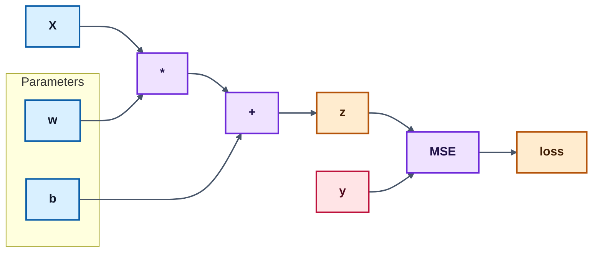
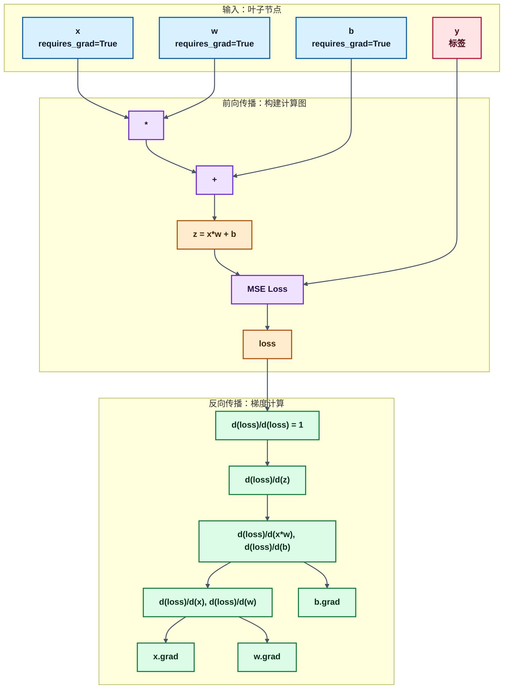

> 读前提示（AI/机器学习视角）
> - **适合人群**：已掌握张量基础，准备理解“训练为什么能更新参数”的学习者。
> - **前置知识**：会写基础前向计算，理解导数/链式法则的直觉意义即可。
> - **读完收获**：你将掌握 Autograd 的工作方式、常用 API 与调试思路，能独立定位梯度相关报错。

# 1 自动微分基础
自动微分（Autograd）是 PyTorch 训练能力的核心。  
在前向传播中，框架会记录“由哪些运算得到当前张量”的计算图；在反向传播中，Autograd 会沿着这张图应用链式法则，自动计算参数梯度。

训练神经网络时，参数更新通常遵循：
`参数 = 参数 - 学习率 * 梯度`。  
而 Autograd 的价值就在于：你只需要定义前向计算，梯度求解由框架自动完成。


## 1.1 计算图与核心概念
- **requires_grad=True**：告诉 PyTorch 需要跟踪该张量的梯度。
- **叶子节点（leaf tensor）**：通常是你手动创建、需要优化的参数，梯度会累积在 `.grad`。
- **计算图（computation graph）**：由前向运算动态构建；每次前向都会新建一张图。
- **标量损失与 backward**：`backward()` 默认从标量输出反传；若输出是向量，需要额外提供 `gradient` 或先做聚合（如 `mean/sum`）。


图中核心概念对应说明：
1. 叶子节点：x、w、b 是手动创建且 requires_grad=True 的张量，它们的梯度会保存在 .grad 属性中。
2. 计算图：由 *、+、MSE 等操作节点动态构建，记录了从输入到损失 loss 的完整运算路径。
3. 前向传播：从左到右执行运算，生成 z 和最终标量损失 loss。
4. 反向传播：从 loss（标量）开始，调用 .backward()，沿计算图反向计算梯度，最终将梯度累积到叶子节点 x.grad、w.grad、b.grad 中。
5. 标量约束：loss 是标量，因此可以直接调用 .backward()；若中间结果是向量，则需先通过 mean()/sum() 聚合为标量。


## 1.2 梯度基本运算
* 采用backward()方法可以进行自动微分
* 采用backward()方法需要f是一个标量，如果不是标量就需要传入一个gradient参数，它是形状匹配的张量(后续在另一篇博客中详述)

### 1.2.1 标量的梯度计算
```python
import torch

# 1. 标量的梯度计算
# y = x**2 + 20
def scalar_gradient_example():

    # 1.对于需要求导的张量需要设置 requires_grad = True
    # 类型一般设置为torch.float64
    x = torch.tensor(10, requires_grad=True, dtype=torch.float64)

    # 2.对x的中间计算
    # 定义关于x的函数
    f = x ** 2 + 20   # 2x
    
    # 3.自动微分
    # 调用backward()之后，会根据f进行求导
    f.backward()

    # 访问梯度
    # 求得方程在x处的梯度
    print(x.grad)
    
```
### 1.2.2 向量的梯度计算
```python
# 2. 向量的梯度计算
# y = x**2 + 20
def vector_gradient_example():

    x = torch.tensor([10, 20, 30, 40], requires_grad=True, dtype=torch.float64)
    # 定义变量的计算过程
    # y1得到的是一个向量，需要将其处理为标量才能使用backward()进行自动微分
    # 采用y1.mean() - 取均值 - 转换为标量
    # 对向量进行求导，就相当于对向量中的每个分量都求导
    y1 = x ** 2 + 20

    # 注意: 自动微分的时候，必须是一个标量
    y2 = y1.mean()  # 1/4 * y1  ==> 1/4 * 2x

    # 自动微分
    # 反向传播
    y2.backward() 

    # 打印梯度值
    # 梯度计算的结果会保存到x.grad中
    print(x.grad) # tensor([ 5., 10., 15., 20.], dtype=torch.float64)
```

### 1.2.3 多标量梯度计算

```python
# 3. 多标量梯度计算
# y = x1**2 + x2**2 + x1*2
def multi_scalar_gradient_example():

    x1 = torch.tensor(10, requires_grad=True, dtype=torch.float64)
    x2 = torch.tensor(20, requires_grad=True, dtype=torch.float64)

    # 中间计算过程
    y = x1**2 + x2**2 + x1*x2

    # 自动微分
    y.backward()

    # 打印梯度值
    print(x1.grad)
    print(x2.grad)
```

### 1.2.4 多向量的梯度计算
```python
# 4. 多向量的梯度计算
def multi_vector_gradient_example():

    x1 = torch.tensor([10, 20], requires_grad=True, dtype=torch.float64)
    x2 = torch.tensor([30, 40], requires_grad=True, dtype=torch.float64)

    # 定义中间计算过程
    y = x1**2 + x2**2 + x1*x2

    # 将输出结果变为标量
    y = y.sum()

    # 自动微分
    y.backward()

    # 打印张量的梯度值
    print(x1.grad)
    print(x2.grad)
```

## 1.3 梯度的控制与管理
* 模型训练的时候需要进行梯度计算
* 模型训练完成，进入到另一个阶段之后，不需要进行梯度计算，由此需要控制梯度的计算


### 1.3.1 控制梯度计算
* 可以通过一定的方式控制是否需要对每个函数进行梯度计算
```python
import torch


# 1. 控制梯度计算
def grad_switching_examples():

    # 创建张量x
    # requires_grad - 表示x需要进行梯度计算
    x = torch.tensor(10, requires_grad=True, dtype=torch.float64)
    print(x.requires_grad)

    # 1. 第一种方法
    # 只想要计算y = x ** 2的数值，而不想计算这个函数的梯度
    with torch.no_grad():
        y = x**2
    print(y.requires_grad) # False，表示不对这个函数进行梯度计算

    # 2. 第二种方式，主要针对函数
    @torch.no_grad()
    def my_func(x):
        return x**2
    y = my_func(x)
    print(y.requires_grad) # False，表示不对这个函数进行梯度计算

    # 3. 第三种方式: 全局的方式
    torch.set_grad_enabled(False)
    y = x ** 2
    print(y.requires_grad)
```

### 1.3.2 梯度累积与梯度清零

```python
# 2. 累计梯度和梯度清零
def gradient_accumulation_and_zeroing():

    x = torch.tensor([10, 20, 30, 40], requires_grad=True, dtype=torch.float64)

    # 当我们重复对x进行梯度计算的时候，是会将历史的梯度值累加到 x.grad 属性中
    # 希望不要去累加历史梯度
    for _ in range(10): # 函数在x处计算10次梯度

        # 对输入x的计算过程
        f1 = x**2 + 20
        # 将向量转换为标量
        f2 = f1.mean()

        # 梯度清零，防止梯度进行累加
        if x.grad is not None:
             x.grad.data.zero_()

        # 自动微分
        f2.backward()
        print(x.grad)

```
* 没有设置梯度清零，重复对同一参数调用 `backward()` 时，历史梯度会继续累加到 `x.grad`

```python
# 设置梯度清零
tensor([ 5., 10., 15., 20.], dtype=torch.float64)
tensor([ 5., 10., 15., 20.], dtype=torch.float64)
tensor([ 5., 10., 15., 20.], dtype=torch.float64)

# 不设置梯度清零
tensor([ 5., 10., 15., 20.], dtype=torch.float64)
tensor([10., 20., 30., 40.], dtype=torch.float64)
tensor([15., 30., 45., 60.], dtype=torch.float64)
tensor([20., 40., 60., 80.], dtype=torch.float64)
tensor([25., 50., 75., 100.], dtype=torch.float64)
tensor([30., 60., 90., 120.], dtype=torch.float64)
tensor([35., 70., 105., 140.], dtype=torch.float64)
tensor([40., 80., 120., 160.], dtype=torch.float64)
tensor([45., 90., 135., 180.], dtype=torch.float64)
tensor([50., 100., 150., 200.], dtype=torch.float64)

```

### 1.3.3 为什么 `mean()` 后梯度会变小？
以 `x = [10, 20, 30, 40]`、`f = (x**2 + 20).mean()` 为例：
- 对每个元素，`d(x^2 + 20)/dx = 2x`
- 因为做了 `mean()`，还要再乘上 `1/4`
- 所以最终梯度是 `2x/4 = x/2`，得到 `[5, 10, 15, 20]`

这就是为什么在训练中，`sum` 和 `mean` 会影响梯度尺度（也会影响学习率敏感性）。

### 1.3.4 案例：梯度下降优化一元函数
- 目标函数：`y = x ** 2`
- 问题：当 `x` 取什么值时，`y` 最小？
- 基本步骤：
  1. 初始化 `x`
  2. 按梯度方向反复迭代更新
```python
# 3. 案例-梯度下降优化函数
def gradient_descent_on_scalar_quadratic():

    # 1.初始化
    x = torch.tensor(10, requires_grad=True, dtype=torch.float64)

    # 进行5000次迭代
    for _ in range(5000):

        # 正向计算，函数
        y = x**2

        # 梯度清零
        if x.grad is not None:
            x.grad.zero_()

        # 自动微分，得到 x 处的梯度值
        y.backward()

        # 更新参数，对 x 的值进行更新
        # 参数更新不需要追踪梯度，应放在 no_grad 上下文中
        with torch.no_grad():
            x -= 0.001 * x.grad

        # 打印 x 的值
        print('%.10f' % x.data)

```
**对于深度学习：**
* y通常为损失函数
* 初始化权重参数，求损失函数在指定权重位置处的梯度
* 更新权重参数


## 1.4 梯度计算注意事项
当对设置 requires_grad=True 的张量使用 numpy 函数进行转换时, 会出现如下报错:

> Can't call numpy() on Tensor that requires grad. Use tensor.detach().numpy() instead.

此时, 需要先使用 detach 函数将张量进行分离, 再使用 numpy 函数.

注意: detach 之后会产生一个新的张量, 新的张量作为叶子结点，并且该张量和原来的张量共享数据, 但是分离后的张量不需要计算梯度。

> b = a.detach()
> a 和 b 共享数据
> 对a的所有操作都会影响到梯度计算
> 对b的所有操作都不会影响梯度计算
> 相当于将一个张量分离出一个数据相同但是用途不同的张量


```python
import torch


# 1. 演示下错误
def numpy_conversion_requires_detach():

    x = torch.tensor([10, 20], requires_grad=True, dtype=torch.float64)
    # RuntimeError: Can't call numpy() on Tensor that requires grad. Use tensor.detach().numpy() instead.
    # print(x.numpy())
    # 下面的是正确的操作
    print(x.detach().numpy())


# 2. 共享数据
def detach_shared_storage_demo():

    # x是叶子结点
    x1 = torch.tensor([10, 20], requires_grad=True, dtype=torch.float64)
    # 使用detach 函数分离出一个新的张量
    x2 = x1.detach()

    print(id(x1.data), id(x2.data))

    # 修改分离后产生的新的张量
    x2[0] = 100
    print(x1)
    print(x2)

    # 通过结果我们发现，x2 张量不存在 requires_grad=True
    # 表示：对 x1 的任何计算都会影响到对 x1 的梯度计算
    # 但是，对 x2 的任何计算不会影响到 x1 的梯度计算

    print(x1.requires_grad)
    print(x2.requires_grad)
```